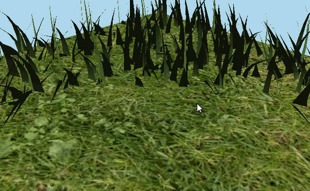
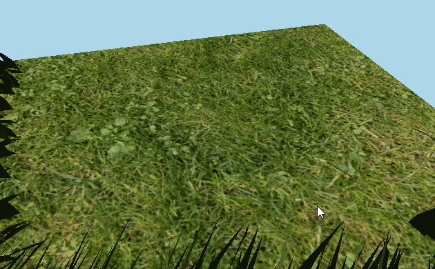
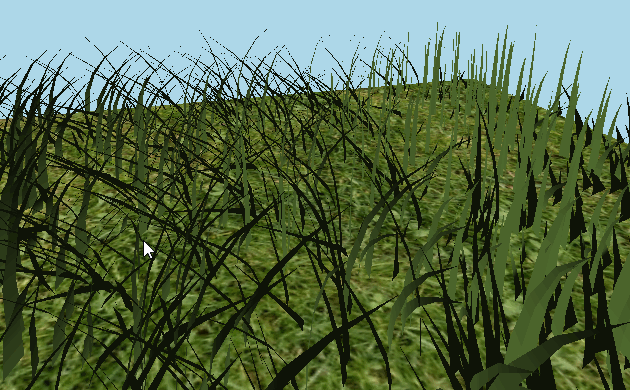

Vulkan Grass Rendering
========================

* Salaar Kohari
  * LinkedIn ([https://www.linkedin.com/in/salaarkohari](https://www.linkedin.com/in/salaarkohari))
  * Website ([http://salaar.kohari.com](http://salaar.kohari.com))
  * University of Pennsylvania, CIS 565: GPU Programming and Architecture
* Tested on: Windows 10, Intel Xeon @ 3.1GHz 32GB, GTX 980 4GB (SIG Lab)

### Introduction
This repository features real-time grass simulation and rendering using Vulkan, based on the paper [Responsive Real-Time Grass Rendering for General 3D Scenes](https://www.cg.tuwien.ac.at/research/publications/2017/JAHRMANN-2017-RRTG/JAHRMANN-2017-RRTG-draft.pdf). The grass simulates forces such as gravity, recovery, and wind for realistic, tunable behavior. Additionally, grass blades can be selectively rendered based on viewport position, orientation, and distance. After describing the general graphics pipeline used to achieve these techniques, I will describe how they individually impact performance. With simulation and culling, the render performs at over 1500 frames per second.

### Pipeline
1. Set up the Vulkan graphics pipeline (send data to shaders using descriptor sets and descriptor set layouts)
2. Simulate wind, gravity, and recovery forces in the compute shader
3. Cull (do not render) grass blades based on orientation, distance, and view-frustum
4. Grass vertex shader to transform positions and calculate bitangent, up vectors
5. Tesselation shader to subdivide grass into Bezier splines for more detail
6. Fragment shader to calculate final color by interpolating vertical position on the blade

### Culling

Distance Culling - Render less grass the further the camera is away from the blades. Has parameters for number of buckets that grass is grouped in for distance culling as well as the interval between these buckets.

Frustum Culling - Do not render grass that is outside the viewport. Has tunable parameter for how far the grass must be outside of the viewport to not be rendered.

Orientation Culling - Do not render grass that is facing perpendicular to the camera. Has tunable parameter for what the angle between camera and grass blade must be to not be rendered.

### Analysis

Clearly, the fps increases with the addition of new culling techniques. Some of these techniques are conditional, for example, frustum culling will only hurt performance if every blade of grass is in the viewport. However, in the general case where the camera is somewhere inside the scene, all culling methods boost performance by about 50 fps or more.

Grass before any simulation forces are applied. According to the analysis, simulation forces cost very little in comparison to the fps gains by various forms of culling.
