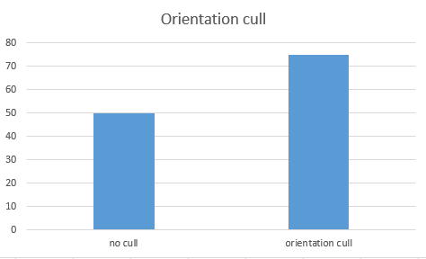
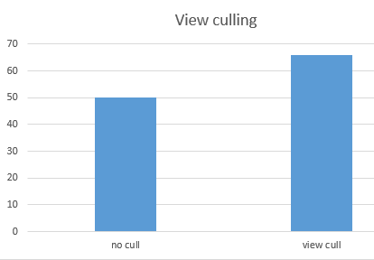
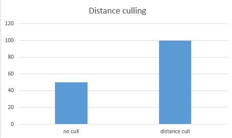
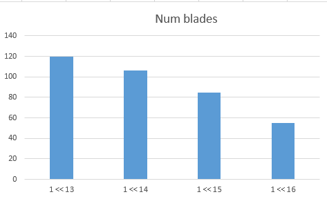

Instructions - Vulkan Grass Rendering
========================

* Henry Zhu
* [Github](https://github.com/Maknee), [LinkedIn](https://www.linkedin.com/in/henry-zhu-347233121/), [personal website](https://maknee.github.io/), [twitter](https://twitter.com/maknees1), etc.
* Tested on: Windows 10 Home, Intel i7-4710HQ @ 2.50GHz 22GB, GTX 870M (Own computer)

# With no movement

# With movement (no culling)

# With orientation culling

# With view culling

# With distance culling

### Contents

* `src/` C++/Vulkan source files.
  * `shaders/` glsl shader source files
  * `images/` images used as textures within graphics pipelines
* `external/` Includes and static libraries for 3rd party libraries.

### Overview

Using the techniques described in this [paper](https://www.cg.tuwien.ac.at/research/publications/2017/JAHRMANN-2017-RRTG/JAHRMANN-2017-RRTG-draft.pdf), I was able to create a simulation of grass. 

The following sections describe each component of the system

### Total force on the grass

#### Gravity

Gravity is the downward/side ways force consisting of environment gravity and front gravity.

The environment gravity is a vector of the gravitational constant (~9.81) downwards on y.

The front gravity is front vector of the grass blade multiplied by the gravity constant * 1/4. This makes the grass blade slide forward slightly.

#### Recovery

Recovery is done by using Hook's law. This can be done by computing a vector that points towards the top of the grass while it is sitting straight up from the current location of the point of the blade.

#### Wind

Wind is complex. It is described in the paper by creating two forces that get mulitiplied and then time is factored into the case to make sure the wind goes from strong to weak to strong, back and forth.

#### Total force

These forces are combined and mulitiplied by the deltaTime (current iteration) and then the new vertices for the top of the grass blade and the new tip of the grass is computed.

### Culling tests

There are blades that should not be rendered. For example, blades that are facing away from us should not be drawned.

#### Orientation culling

This cull is done by checking the dot product between the front vector of the grass and the view angle. Basically, if the grass blade is facing (almost) perpendicular to the camera, the grass blade will not be drawn

##### Performance:

#### View-frustum culling

View frustum culling is done by checking if the three points of the blade is within the view frustrum.

##### Performance:

View frustum culling is improved even more as more grass blades are behind the screen/not in the view of the user.

*this is measure 1/2 in the grass*

#### Distance culling

This is done by checking the distance from the camera. We place the blades into buckets and if the are in not in the distance, the blades are culled 

##### Performance:

*this is measured when ~ half the grass is culled*

Distance culling is more effective when more grass is culled (aka more distance is between the grass and camera)

### Performance Analysis

#### Increasing grass blades (with culling enabled)

*this is measured when ~ half the grass is culled*

The FPS decreases over time, but really goes downward towards the end.

#### The culling performances are described above.

## Resources

### Links

* [Responsive Real-Time Grass Grass Rendering for General 3D Scenes](https://www.cg.tuwien.ac.at/research/publications/2017/JAHRMANN-2017-RRTG/JAHRMANN-2017-RRTG-draft.pdf)
* [CIS565 Vulkan samples](https://github.com/CIS565-Fall-2018/Vulkan-Samples)
* [Official Vulkan documentation](https://www.khronos.org/registry/vulkan/)
* [Vulkan tutorial](https://vulkan-tutorial.com/)
* [RenderDoc blog on Vulkan](https://renderdoc.org/vulkan-in-30-minutes.html)
* [Tessellation tutorial](http://in2gpu.com/2014/07/12/tessellation-tutorial-opengl-4-3/)

