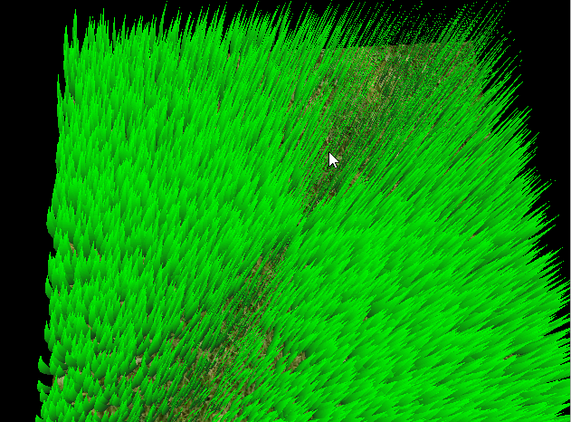
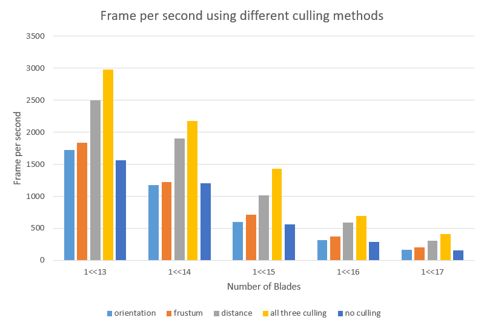

Vulkan Grass Rendering
===============

[CLICK ME FOR INSTRUCTION OF THIS PROJECT](./instruction.md)

**University of Pennsylvania, CIS 565: GPU Programming and Architecture, Project 6**

* Siyu Zheng
* Tested on: Windows 10, i7-8750 @ 2.20GHz 16GB, GTX 1060 6GB, Visual Studio 2015, CUDA 8.0(Personal Laptop)

## Vulkan Grass Rendering
   

## Grass Rendering

This project is an implementation of the paper, [Responsive Real-Time Grass Rendering for General 3D Scenes](https://www.cg.tuwien.ac.at/research/publications/2017/JAHRMANN-2017-RRTG/JAHRMANN-2017-RRTG-draft.pdf).

### Representing Grass as Bezier Curves

In this project, grass blades will be represented as Bezier curves while performing physics calculations and culling operations. 
Each Bezier curve has three control points.
* `v0`: the position of the grass blade on the geomtry
* `v1`: a Bezier curve guide that is always "above" `v0` with respect to the grass blade's up vector (explained soon)
* `v2`: a physical guide for which we simulate forces on

We also need to store per-blade characteristics that will help us simulate and tessellate our grass blades correctly.
* `up`: the blade's up vector, which corresponds to the normal of the geometry that the grass blade resides on at `v0`
* Orientation: the orientation of the grass blade's face
* Height: the height of the grass blade
* Width: the width of the grass blade's face
* Stiffness coefficient: the stiffness of our grass blade, which will affect the force computations on our blade

We can pack all this data into four `vec4`s, such that `v0.w` holds orientation, `v1.w` holds height, `v2.w` holds width, and 
`up.w` holds the stiffness coefficient.

### Simulating Forces

There are 3 types of simulating forces, gravity, wind and recovery. We just add them together as the total force. Then determine a translation for `v2` based on the forces as `tv2 = (gravity + recovery + wind) * deltaTime`. Also we need to determine the corrected final positions for `v1` and `v2` using state validation. 

### Culling tests

Although we need to simulate forces on every grass blade at every frame, there are many blades that we won't need to render
due to a variety of reasons. Here are some heuristics we can use to cull blades that won't contribute positively to a given frame.

| All culling        | Orientation culling           |
| ------------- |:-------------:|
| Do all three culling| Cull blade whose front face direction of the grass blade is perpendicular to the view vector |
|   |    |

| View-frustum culling       | Distance culling            |
| ------------- |:-------------:|
| Cull blades that are outside of the view-frustum | Cull grass blades that at large distances are smaller than the size of a pixel |
|       |    |

## Performance Analysis

 

From the graph we can see that culling improve performance a lot since we don't need to render those culled blades. The performance difference might depend on the diameter we choose for these three kinds of culling. In my test, the distance culling improve performance most as blades beyond a maximum distance are removed. For orientation culling, there is only a few of blades got removed since the threshold I set for orientation culling is low. On the other hand, as the number of blades increase, the performance decreases.

 

## Resources

### Links

The following resources may be useful for this project.

* [Responsive Real-Time Grass Grass Rendering for General 3D Scenes](https://www.cg.tuwien.ac.at/research/publications/2017/JAHRMANN-2017-RRTG/JAHRMANN-2017-RRTG-draft.pdf)
* [CIS565 Vulkan samples](https://github.com/CIS565-Fall-2018/Vulkan-Samples)
* [Official Vulkan documentation](https://www.khronos.org/registry/vulkan/)
* [Vulkan tutorial](https://vulkan-tutorial.com/)
* [RenderDoc blog on Vulkan](https://renderdoc.org/vulkan-in-30-minutes.html)
* [Tessellation tutorial](http://in2gpu.com/2014/07/12/tessellation-tutorial-opengl-4-3/)
