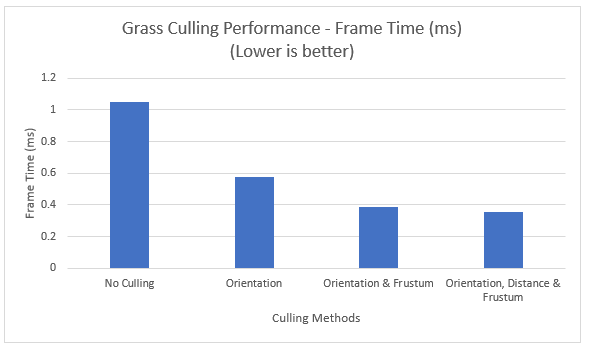
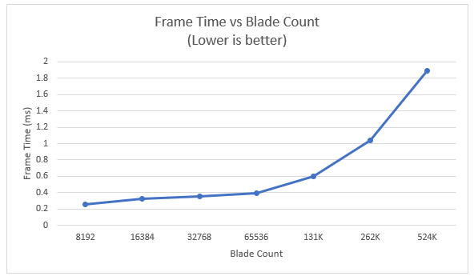

Vulkan Grass Rendering
========================

* Vasu Mahesh
  * [LinkedIn](http://linkedin.com/in/vasumahesh)
  * [Code Blog](http://www.codeplaysleep.com)

### Representing Grass

Grass is represented as Bezier Curves
* `v0`: the position of the grass blade on the geomtry
* `v1`: a Bezier curve guide that is always "above" `v0` with respect to the grass blade's up vector (explained soon)
* `v2`: a physical guide for which we simulate forces on

We also need to store per-blade characteristics that will help us simulate and tessellate our grass blades correctly.
* `up`: the blade's up vector, which corresponds to the normal of the geometry that the grass blade resides on at `v0`
* Orientation: the orientation of the grass blade's face
* Height: the height of the grass blade
* Width: the width of the grass blade's face
* Stiffness coefficient: the stiffness of our grass blade, which will affect the force computations on our blade

We can pack all this data into four `vec4`s, such that `v0.w` holds orientation, `v1.w` holds height, `v2.w` holds width, and 
`up.w` holds the stiffness coefficient.

### Simulating Forces

Following forces were implemented:

- Gravity

  Given a gravity direction, `D.xyz`, and the magnitude of acceleration, `D.w`, we can compute the environmental gravity in
  our scene as `gE = normalize(D.xyz) * D.w`.

  We then determine the contribution of the gravity with respect to the front facing direction of the blade, `f`, 
  as a term called the "front gravity". Front gravity is computed as `gF = (1/4) * ||gE|| * f`.

  We can then determine the total gravity on the grass blade as `g = gE + gF`.

- Recovery
  
  Recovery corresponds to the counter-force that brings our grass blade back into equilibrium. This is derived in the paper using Hooke's law.
  In order to determine the recovery force, we need to compare the current position of `v2` to its original position before
  simulation started, `iv2`. At the beginning of our simulation, `v1` and `v2` are initialized to be a distance of the blade height along the `up` vector.

  Once we have `iv2`, we can compute the recovery forces as `r = (iv2 - v2) * stiffness`.

- Wind

  Basic wind function that accepts the blade origin and returns the wind vec3.

#### Binding Resources

In order to update the state of your grass blades on every frame, you will need to create a storage buffer to maintain the grass data.
You will also need to pass information about how much time has passed in the simulation and the time since the last frame. To do this,
you can extend or create descriptor sets that will be bound to the compute pipeline.

### Culling tests

#### Orientation culling

If the grass blade is perpendicular to the look axis, we can cull the blade.

Example of an aggressive orientation cull:

#### View-frustum culling

We also want to cull blades that are outside of the view-frustum, considering they won't show up in the frame anyway. To determine if
a grass blade is in the view-frustum, we want to compare the visibility of three points: `v0, v2, and m`, where `m = (1/4)v0 * (1/2)v1 * (1/4)v2`.
Notice that we aren't using `v1` for the visibility test. This is because the `v1` is a Bezier guide that doesn't represent a position on the grass blade.
We instead use `m` to approximate the midpoint of our Bezier curve.

If all three points are outside of the view-frustum, we will cull the grass blade. The paper uses a tolerance value for this test so that we are culling
blades a little more conservatively. This can help with cases in which the Bezier curve is technically not visible, but we might be able to see the blade
if we consider its width.

Example of an aggressive frustum cull:

#### Distance culling

Similarly to orientation culling, we can end up with grass blades that at large distances are smaller than the size of a pixel. This could lead to additional
artifacts in our renders. In this case, we can cull grass blades as a function of their distance from the camera.

You are free to define two parameters here.
* A max distance afterwhich all grass blades will be culled.
* A number of buckets to place grass blades between the camera and max distance into.

Define a function such that the grass blades in the bucket closest to the camera are kept while an increasing number of grass blades
are culled with each farther bucket.

Example of an aggressive distance cull:

## Performance Analysis of Culling

Culling improves performance by over 50%. Orientation cull saw the most significant drop. The graph below is for 8192 blades.

## Performance Analysis of Grass Blade Count

No suprise here that as the number of grass blades increase, performance drops. We can see quite a large increase in frame times for around 500K grass blades. This graph also includes the performance gains from all the culling methods as well.

### References

* [Responsive Real-Time Grass Grass Rendering for General 3D Scenes](https://www.cg.tuwien.ac.at/research/publications/2017/JAHRMANN-2017-RRTG/JAHRMANN-2017-RRTG-draft.pdf)
* [CIS565 Vulkan samples](https://github.com/CIS565-Fall-2018/Vulkan-Samples)
* [Official Vulkan documentation](https://www.khronos.org/registry/vulkan/)
* [Vulkan tutorial](https://vulkan-tutorial.com/)
* [RenderDoc blog on Vulkan](https://renderdoc.org/vulkan-in-30-minutes.html)
* [Tessellation tutorial](http://in2gpu.com/2014/07/12/tessellation-tutorial-opengl-4-3/)
