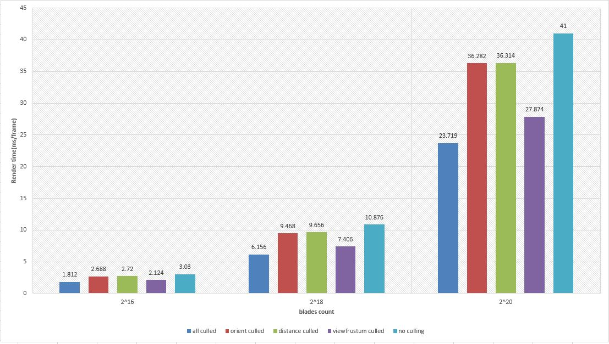

Vulkan Grass Rendering
======================

**University of Pennsylvania, CIS 565: GPU Programming and Architecture, Project 5**

* Lan Lou
* Tested on: Windows 10, i7-6700HQ @ 2.60GHz 16GB, GTX 1070 8GB (Personal Laptop)

## Demo rendering

## Introduction:

This project is based on the paper : [Responsive Real-Time Grass Rendering for General 3D Scenes](https://www.cg.tuwien.ac.at/research/publications/2017/JAHRMANN-2017-RRTG/JAHRMANN-2017-RRTG-draft.pdf)

By using vulkan -- a  high-performance realtime 3D graphics API, we can create scenes consist of billions of primitive objects, which makes vulkan a rather suitable API for 
realtime grass rendering. According to the paper, I created a compute shader for simulation of various grass physical features like gravity, stiffness, as well as wind force,
and also the validation of grass, including 3 culling operation to enhance performace,a tessellation shader for the geometry detail of a single grass blade, which makes it 
tessellated based on a bezier curve, finally, inside the renderer.cpp, I completed the vulkan rendering pipeline.

## grass culling:

### distance culling:

when grass blades are too far away, we will face two problems : 
- due to the lower precision of depth values in the distance, zfighting can occur
- blades at high distances are smaller than a pixel, which can cause aliasing artifacts

besides, sometimes people won't care so much when things are too far away .

 

### orientation culling:

as there are no such property as thickness for a grass blade, we can therefore ignore it when it's not facing directly 
to the camera, again, if we don't do this aliasing artifacts might occur.

### view frustum culling:

we also want to check if a grass blade is inside the view frustum or not, we will have to use three points : v0, a middle point and v2 
, transfrom their coord into NDc space and then compare the boudning of screen plus a centain tolerance...

## Custom scenes

Scenes below show different wind patterns 

This is the helicopter scene based on the paper.

An interesting scene under different shading method

flat shading|lambert shading
----|---
|

## Performance Analysis

the test is conducted using the helicopter scene, the chart basically shows how rendering time change with respect to numbers of grass blades and different 
culling technique

apparently, with the increasing of grass blade count, rendering time of each frame increases exponentially, 
also from the result we can tell that view frustum culling have the best effect but it is based on the viewing position and orientation
, thus I guess it's subject to change very easily once you pan the camera.

## Resources

### Links

The following resources may be useful for this project.

* [Responsive Real-Time Grass Grass Rendering for General 3D Scenes](https://www.cg.tuwien.ac.at/research/publications/2017/JAHRMANN-2017-RRTG/JAHRMANN-2017-RRTG-draft.pdf)
* [CIS565 Vulkan samples](https://github.com/CIS565-Fall-2018/Vulkan-Samples)
* [Official Vulkan documentation](https://www.khronos.org/registry/vulkan/)
* [Vulkan tutorial](https://vulkan-tutorial.com/)
* [RenderDoc blog on Vulkan](https://renderdoc.org/vulkan-in-30-minutes.html)
* [Tessellation tutorial](http://in2gpu.com/2014/07/12/tessellation-tutorial-opengl-4-3/)

