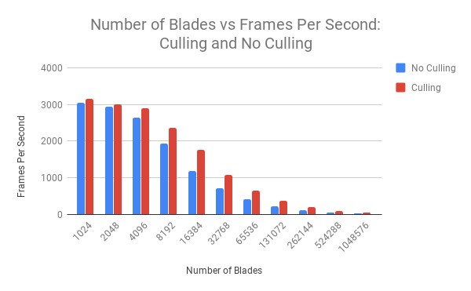
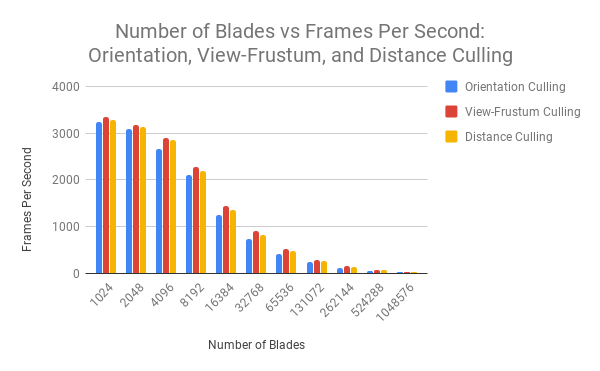

Vulkan Grass Rendering
======================

**University of Pennsylvania, CIS 565: GPU Programming and Architecture, Project 6**

* Eric Chiu
* Tested on: Windows 10 Education, Intel(R) Xeon(R) CPU E5-1630 v4 @ 3.60GHz 32GB, NVIDIA GeForce GTX 1070 (SIGLAB)

## Results

## Description

This project implements a grass simulation using Vulkan and GPU hardware. It is based on the paper: [Responsive Real-Time Grass Rendering for General 3D Scenes](https://www.cg.tuwien.ac.at/research/publications/2017/JAHRMANN-2017-RRTG/JAHRMANN-2017-RRTG-draft.pdf). Features include binding resources, gravity simulation, recovery simulation, wind simulation, orientation culling, view-frustum culling, and distance culling.

## Performance Analysis

The following graph shows the frames per second as the number of blades increase for culling and no culling grass simulations. Clearly, the culling grass simulation is faster than the no culling grass simulation. This is because in the culling grass simulation, we ignore rendering blades of grass that do not contribute positively to a given frame. This saves a lot of processing time. Interestingly enough, as the number of blades increase, the gap between the performance of the culling grass simulation and the no culling grass simulation increases. This is probably because the number of visible grass blades stay relatively the same, while the number of occluded grass blades increase.  

The following graph breaks down culling even further, and shows the frames per second as the number of blades increase for orientation culling, view-frustum culling, and distance culling. Orientation culling ignores blades of grass that are not facing the camera because our blades do not have width. View-frustum culling ignores blades of grass that are in the scene, but not visible from the camera. Distance culling ignores blades of grass that are smaller than a pixel large. We can see from the graph that view-frustum culling is the most efficient, then distance culling, and finally orientation culling. This is probably due to the fact that the camera does not typically need to capture a whole field of grass, and it is more common for blades of grass to be far away than it is for blades of grass to not face the camera.

