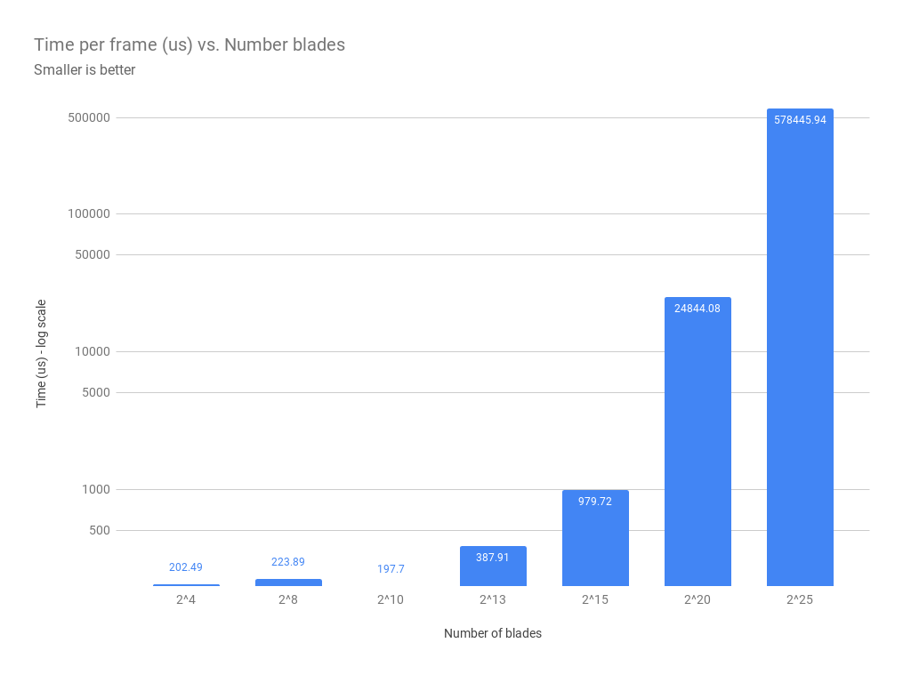
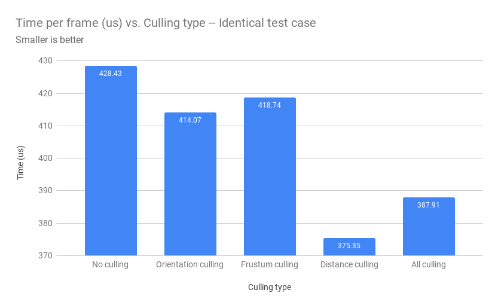
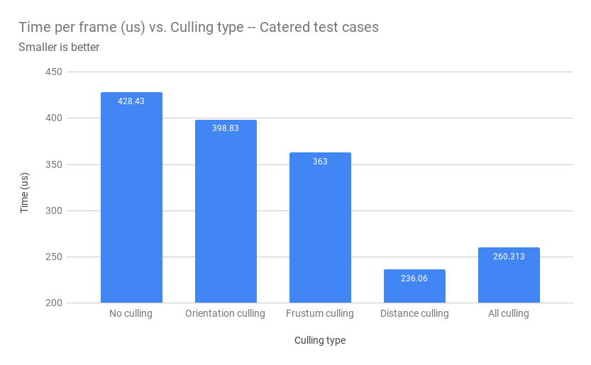

Vulkan Grass Rendering
===============

**University of Pennsylvania, CIS 565: GPU Programming and Architecture, Project 6**

## Vulkan Grass Rendering with Tessellation
### Connie Chang
  * [LinkedIn](https://www.linkedin.com/in/conniechang44), [Demo Reel](https://www.vimeo.com/ConChang/DemoReel)
* Tested on: Windows 10, Intel Xeon CPU E5-1630 v4 @ 3.70 GHz, GTX 1070 8GB (SIG Lab)

  
A gif of 2^15 grass blades with a helicopter wind force

## Introduction
This project is an implementation of [Responsive Real-Time Grass Rendering for General 3D Scenes](https://www.cg.tuwien.ac.at/research/publications/2017/JAHRMANN-2017-RRTG/JAHRMANN-2017-RRTG-draft.pdf). Grass blades are efficiently generated and rendered by modeling them as quadratic bezier curves. The twist: utilizing the GPU with Vulkan. Using Vulkan to parallelize rendering and force computations allows for up to 2^20 individual grass blades to be displayed with a decent framerate. A more in depth performance analysis is at the bottom of the page.  

Here is an overview of the graphics pipeline:  
  * Compute shader - Calculates gravity, recovery, and wind forces. Performs orientation, frustum, and distance culling.  
  * Vertex shader - Simplay passes data along as is.  
  * Tessellation Control shader - Provides subdivision parameters  
  * Tessellation Evaluation shader - Adds new vertices by subdiving, turning a bezier curve into a 2D surface. Moves the vertices so they follow the bezier curve.  
  * Fragment shader - Colors the fragments.  

## Features
- Vulkan pipeline, passing uniform variables with descriptors  
- Force calculations: gravity, recovery, wind (helicopter!)  
- Culling: orientation, frustum, distance  
- Tessellation  
- Colors fragments based on height. Attempted Lambertian shading but it was too dark.  

## Grass Geometry
Each blade of grass is represented as a quadratic bezier curve. It has three control points: v0, v1, and v2. v0 is the base of the grass on the ground. v1 is a control point that determines the curve, but is not used for rendering. v2 is the tip of the grass.  
  
An image from the paper showing the bezier curve control points of a blade of grass.  

In the tessellation shader, vertices are added to create a 2D sheet. These vertices are moved so they produce a curved grass blade, with a wider base and thinner tip. The math was taken from the original paper.  

## Force
  
No forces  

Without any forces acting on the grass, each blade simply stands straight up, unmoving. The gif above shows this. While the result looks nice, it's pretty boring. Therefore, three types of forces are added: gravity, recovery, and wind. All forces are applied only to v2, as v0 should not move the base and v1 is not drawn. However, the v1 control point is modified so the final bezier curve matches the v0 and v1 positions.   

#### Gravity
Gravity is straightforward. It is a constant downward force on v2. The value of gravity is set to 9.8 in this simulation.  

#### Recovery
The recovery force acts analagously to a spring. After gravity is applied, the grass has a stiffness coefficient that gives the grass a desire to bounce back to its original position. Therefore, the grass does not droop too much from gravity because it is also exerting a spring force to return upright.  

#### Wind
A wind force is applied to each grass blade to simulate the real-life effect of a breeze interacting with a patch of grass. For this project, I created a wind force that looks like a helicopter is spinning above the grass. The force direction depends on the grass position and the magnitude fluctuates in a circular fashion with dependencies on time and position. The following is how the direction and magnitude are calculated within the compute shader:  
```
vec3 wDir = normalize(cross(vec3(0, 1, 0), vec3(v0.x, 0, v0.z)));
float wMag = abs(cos(totalTime + v0.z / v0.x)) * 30 * abs(dot(tangent, wDir));
```

  
All forces  

## Culling
To make our grass more efficient, three kinds of culling were implemented to reduce the amount of grass calculations.  

### Orientation culling
The first type of culling is orientation culling. Since a grass blade is a 2D surface, it has no depth. Any grass blade that is rotated 90 degress from the camera will be an indiscernable thin slice in the final image. Since these blades are barely noticeable, it's okay to cull them out and save some computation time.  

The threshold for culling was decreased in this gif to make the effect more prevalent. Notice how grass blades are not drawn as their normals approach a 90 degree angle with the camera's view vector.  
  

### Frustum culling
Frustum culling is culling out grass blades if they fall outside the camera's frustum. These blades are not visible to the camera, so there is no need to continue computations on them. This test is done by transforming v0 from world space into the camera's projection space, which gives the NDC coordinates of the point. If the point falls outside the limits of NDC, then it is outside the camera's view and is culled. Below is a gif with an exaggerated threshold for culling. This is for demonstration purposes to display how grass near the left, right, and bottom of the screen is culled.  
  

### Distance culling
The third culling is based on the grass blade's distance from the camera. If the grass exceeds a maximum distance, then it is culled. In addition, there are various buckets that the distance values fall in. For closer buckets, more grass is shown, whereas further buckets have less grass. The math and culling conditions were taken from the paper.  
  


### Performance Analysis
The final project runs at pretty good rate. It can simulate up to 2^25 blades of grass, although it becomes slow at that point. However, it can handle up to 2^20 very well.  

  
How the number of grass blades influences the average runtime per frame in microseconds.  

The above chart shows how the average time per frame changes with increasing grass blades. Note that the Y-axis is using a logarithmic scale. To measure time, the camera was moved so that it was above the grass patch, looking down on it. The camera was far enough that the entire patch is visible. The performance is as expected with larger numbers of grass taking more time.  

  
How the various culling methods impact time  

This chart shows how each type of culling decreases the time per frame. One may notice that orientation and frustum culling did not improve time as much as distance did. However, this is merely an effect of how the data was gathered. For the values obtained for this particular graph, each test was done with the camera above the grass, looking down such that the entire patch is visible. Since the entire patch is visible within the camera's frustum, frustum culling does not take effect. Likewise, it is less likely that a grass blade is oriented such that culling happenes. However, distance makes an impact because the camera was zoomed out a lot, so some grass blades were culled.  

Different tests were run for each type of culling to showcase how they can be taken advantage of.  
  

For this graph, the times are much better for all culling types. For orientation, the camera was moved to be horizontal with the ground plane. For frustum culling, the camera was zoomed in so not all blades were visible. For distance culling, the camera was zoomed out such that about half of the grass is culled.  

One may notice that all culling runs slower than having only distance culling for both graphs. This occurs because the test case for all culling does not take advantage of distance culling, with the camera placed closer to the grass.  


### Special Thanks
* Vasu Mahesh, Ishan Ranade, Mohamed Soudy, Aman Sachan
