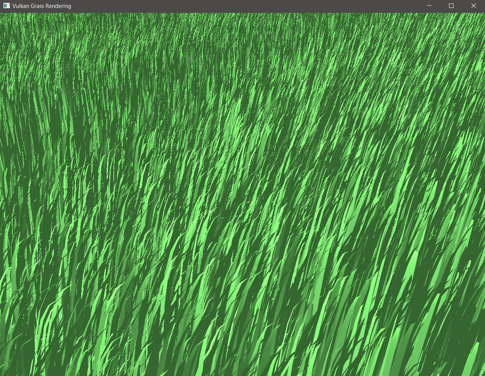
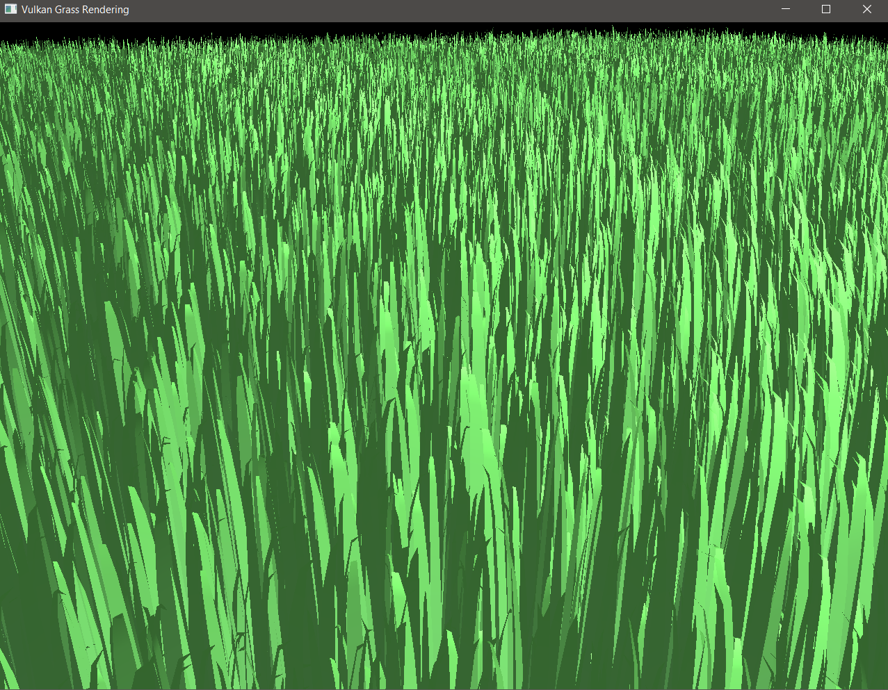
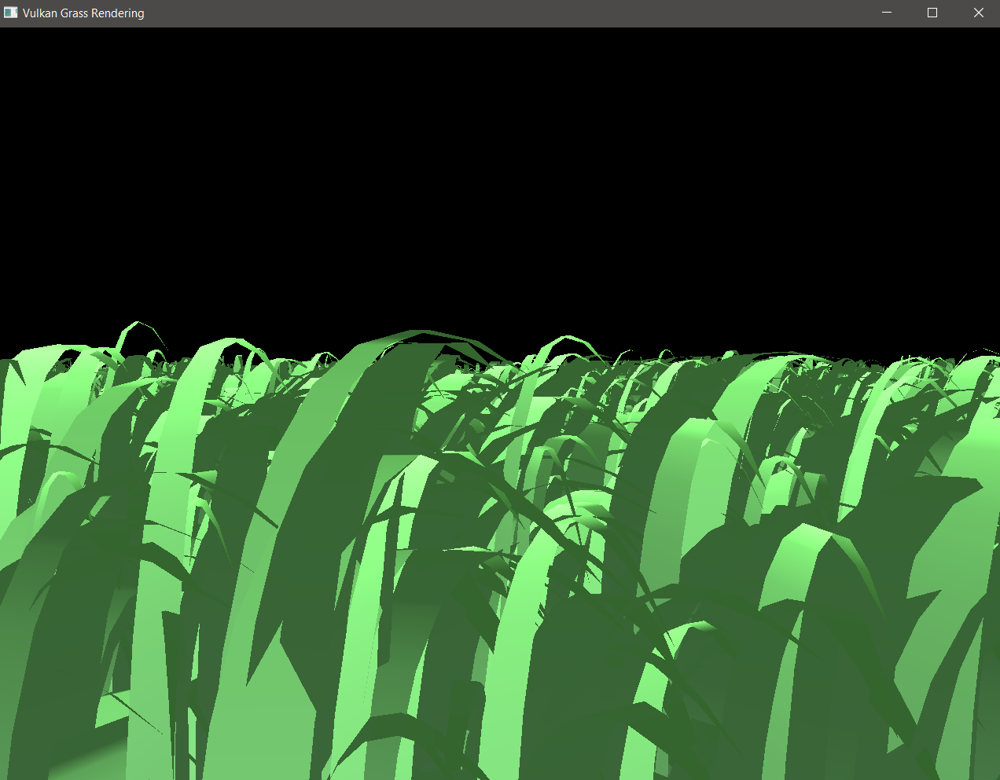
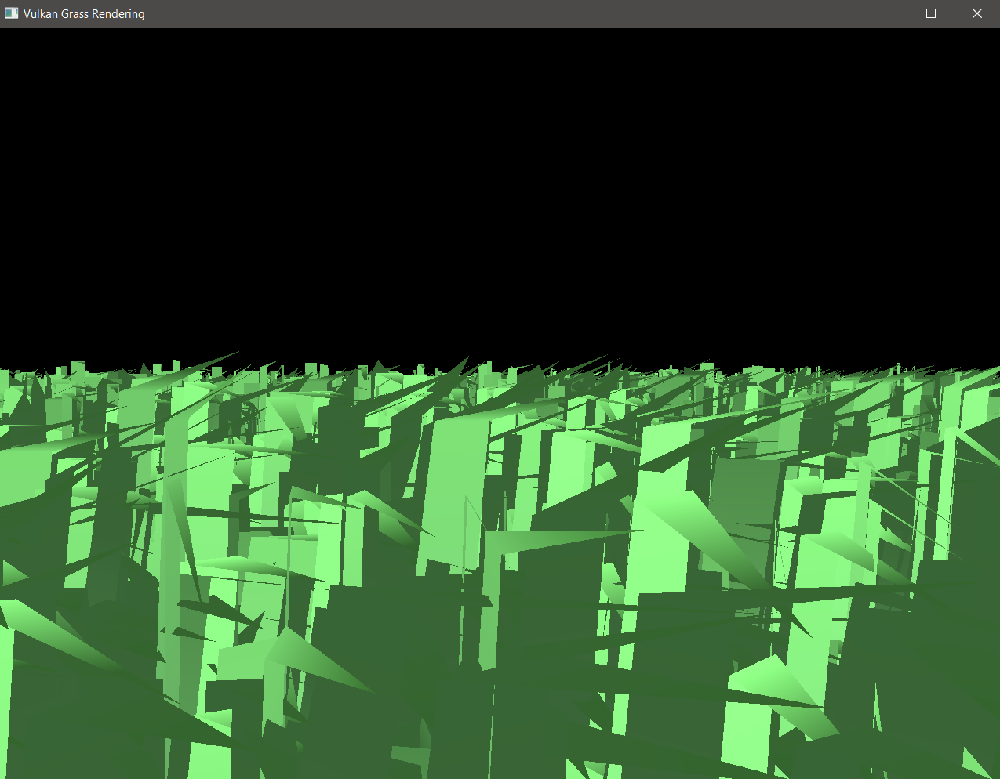
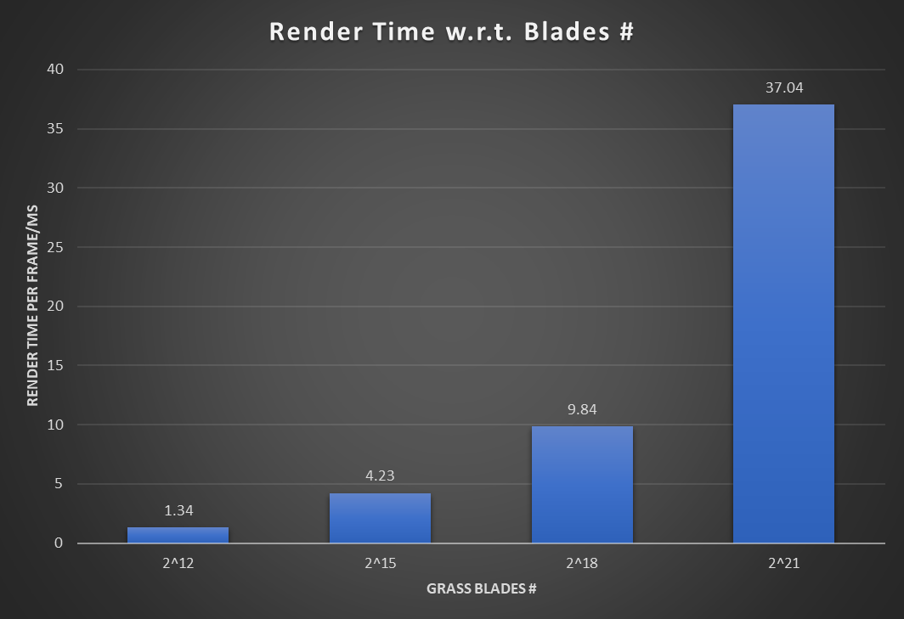

Vulkan Grass Rendering
========================

**University of Pennsylvania, CIS 565: GPU Programming and Architecture, Project 5**

* Jie Meng
  * [LinkedIn](https://www.linkedin.com/in/jie-meng/), [YouTube](https://www.youtube.com/channel/UC7G8fUcQrrI_1YnXY5sQM6A).
* Tested on: Windows 10, i7-7700HQ @ 2.80GHz, 16GB, GTX 1050 4GB (Personal Laptop)

### Demo gif

####Still view
------------------------

-----------------------

####Motion View
---------------------------

------------------------

Does it remind you of  ?

Project Summary
======================

### Description
This project is an Vulkan implementation of the I3D paper: [Responsive Real-Time Grass Rendering for General 3D Scenes](https://www.cg.tuwien.ac.at/research/publications/2017/JAHRMANN-2017-RRTG/JAHRMANN-2017-RRTG-draft.pdf).

Follow the steps in the paper, a grass is represented as a Bezier curve with width (essentially a quad). A compute shader is created to handle physics calculation and culling. Such that all grass blades are processed in parallel. After computation, the unculled blades are pass to graphics pipeline, and effectively become meshes after tessellation, which are then rendered to screen.

### Result images

Configuration: 100x100 underlying plane, 2^21 grass blades

View 1:

------------------------

View 2:

------------------------

### Compute Shader

The compute shader mainly has two parts: first apply force and update positions; then cull unnecessary blades out.

 * The force applied on each grass including gravity, recovery force (treat grass as elastic object) and external wind force. Essentially, these forces are accelerations. The postion of the top of a blade is updated given such acceleration and elapsed time.

 * In the culling stage, three culling scehmes are used together: first cull the blades that face backwards; then cull the blades outside frustum; finally cull the blades that are too far away.

### Graphics Shders

After compute shader, we have information of the shapes of blades at current frame. We go through several stages to render it out: (only programmable stages are listed)

 * Vertex shader: only perform model transformation here, since we have tessellation shaders
 * Tessellation Control shader: pass data from vertex shader to next stage, set tessellation levels according to distance: nearer blades have finer tessellation levels, farther blades have relatively rough ones.
 * Tessellation Evaluation shader: after tessellation, given (u,v) values, calculate fragment positions. Also, the paper uses function transformations to render quad blades into different shapes, like triangles, quadratics, etc.
 * Fragment shader: color the fragment using lambertian shading

**Illustration on Tessellation Levels**

High  |   Low
------|-------
 | 

Analysis
====================

**Configuration: 1280x960 window, 100x100 underlying plane, 2^18 grass blades**

### Grass Blades number

As number of blades goes up, it takes longer time to render. But overall, the performance is very good: even at like 2^21 (about 2M blades), it still gives very good FPS. Besides, here only very simple culling is used, so there is still a large space to improve performance further.

### Culling Methods

**Fixed camera position and view angle to control variable in this test**

Here the orientation culling doesn't make a big difference. I guess it's because the culling threshold (0.01) is not small enough, or maybe I happen to choose a bad view for orientation culling. On the other hand, View-frustum and distance culling work better, I believe it's still relying on the camera view. Overall the culling stage performs well: with all culling methods on, we saved about 40% render time.

## References

* [Responsive Real-Time Grass Grass Rendering for General 3D Scenes](https://www.cg.tuwien.ac.at/research/publications/2017/JAHRMANN-2017-RRTG/JAHRMANN-2017-RRTG-draft.pdf)
* [Official Vulkan documentation](https://www.khronos.org/registry/vulkan/)
* [Vulkan tutorial](https://vulkan-tutorial.com/)
* [Tessellation tutorial](http://in2gpu.com/2014/07/12/tessellation-tutorial-opengl-4-3/)

