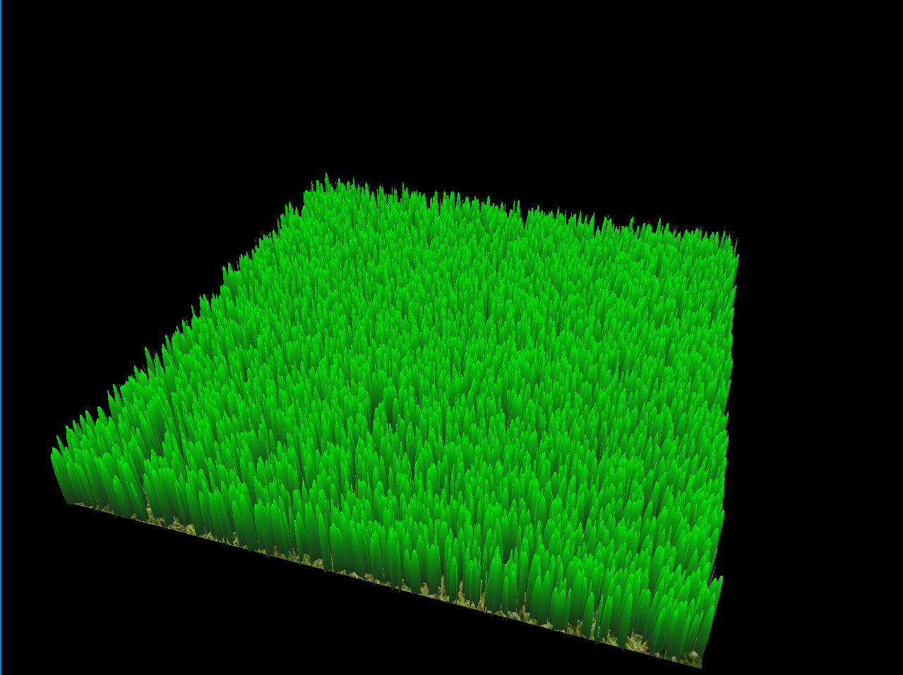
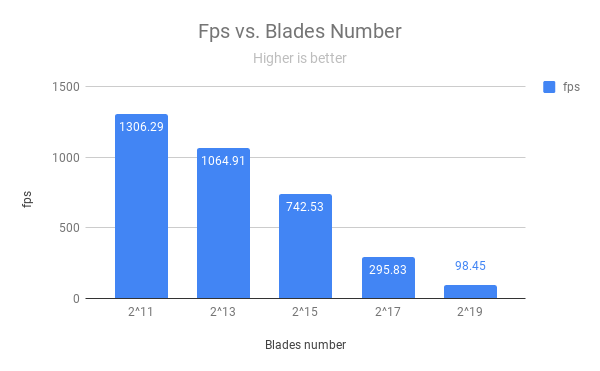
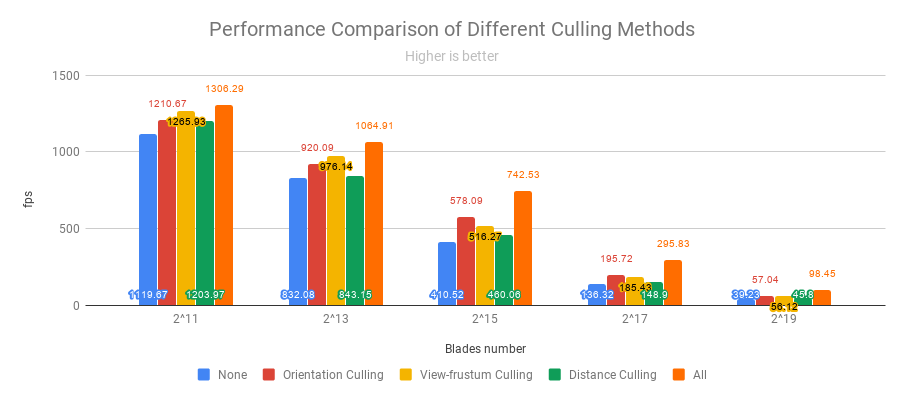

Instructions - Vulkan Grass Rendering
========================

**University of Pennsylvania, CIS 565: GPU Programming and Architecture, Project 6**

* Wanru Zhao
  * [LinkedIn](www.linkedin.com/in/wanru-zhao).
* Tested on: Windows 10, Intel(R) Core(TM) i7-8750H CPU@2.2GHz, GTX 1070 with Max-Q Design(Personal Laptop)

### Final Render

  

### Features

* Compute shader
  * Add forces: gravity, recovery and wind
  * Perform culling: orientation, view-frustum and distance
* Grass pipeline stages
  * Vertex shader: transform vertices
  * Tessellation control shader: passing needed info and tessellation level
  * Tessellation evaluation shader: performing interpolation along Bezier Curves
  * Fragment shader: final shading

### Results

#### Grass Model

  

#### Culling

Orientation Culling | View-frustum Culling | Distance Culling
:--:|:--:|:--:
||

### Performance Analysis
#### Performance of different blade numbers (all culling)

  

From above chart, we can find out that obviously, when the number of blades increases, the fps will decrease. 

#### Performance of different culling methods

  

When all three culling methods are used to reduce the number of blades, the performance of rendering is the best. Non-culling rendering is the worst among all methods. For single culling strategy, the performance benefits most from orientation culling. This is because the orientation case is more general and of more blades than others. In test, I used near scene, so the performance improvement from distance culling is small, when the scene is far away from camera, the improvement will be better. Also for view-frustum culling, it is of more help when the scene is closer to the clip plane, since more grass will be culled at edges of screen.

## Resources

### Links

The following resources may be useful for this project.

* [Responsive Real-Time Grass Grass Rendering for General 3D Scenes](https://www.cg.tuwien.ac.at/research/publications/2017/JAHRMANN-2017-RRTG/JAHRMANN-2017-RRTG-draft.pdf)
* [CIS565 Vulkan samples](https://github.com/CIS565-Fall-2018/Vulkan-Samples)
* [Official Vulkan documentation](https://www.khronos.org/registry/vulkan/)
* [Vulkan tutorial](https://vulkan-tutorial.com/)
* [RenderDoc blog on Vulkan](https://renderdoc.org/vulkan-in-30-minutes.html)
* [Tessellation tutorial](http://in2gpu.com/2014/07/12/tessellation-tutorial-opengl-4-3/)
