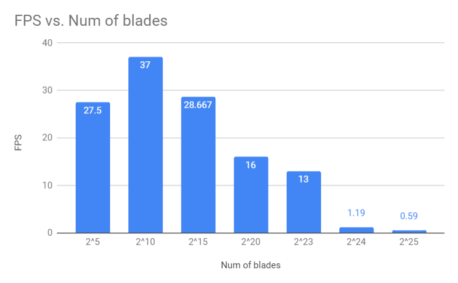

Vulkan-Grass-Rendering
===============

[CLICK ME FOR INSTRUCTION OF THIS PROJECT](./INSTRUCTION.md)

**University of Pennsylvania, CIS 565: GPU Programming and Architecture, Project 6**

* Xinyu Lin
[Linkedin](https://www.linkedin.com/in/xinyu-lin-138352125/)
* Tested on: Windows 10, Intel(R) Core(TM) i7-6700HQ CPU@2.60GHz, 16GB, GTX960M(Private Computer)

### Final Render

### Features

* Compute shader
  * Add forces: gravity, recovery and wind
  * Perform culling: orientation, view-frustum and distance
* Grass pipeline stages
  * Vertex shader: transform vertices
  * Tessellation control shader: passing needed info and tessellation level
  * Tessellation evaluation shader: performing interpolation along Bezier Curves
  * Fragment shader: final shading
  
#### Culling

Orientation Culling | View-frustum Culling | Distance Culling
:--:|:--:|:--:
||

### Performance Analysis
#### Performance of different blade numbers (all culling)

  

## Resources

### Links

The following resources may be useful for this project.

* [Responsive Real-Time Grass Grass Rendering for General 3D Scenes](https://www.cg.tuwien.ac.at/research/publications/2017/JAHRMANN-2017-RRTG/JAHRMANN-2017-RRTG-draft.pdf)
* [CIS565 Vulkan samples](https://github.com/CIS565-Fall-2018/Vulkan-Samples)
* [Official Vulkan documentation](https://www.khronos.org/registry/vulkan/)
* [Vulkan tutorial](https://vulkan-tutorial.com/)
* [RenderDoc blog on Vulkan](https://renderdoc.org/vulkan-in-30-minutes.html)
* [Tessellation tutorial](http://in2gpu.com/2014/07/12/tessellation-tutorial-opengl-4-3/)
