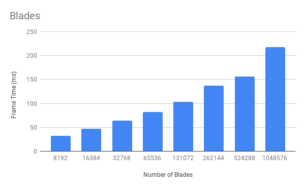
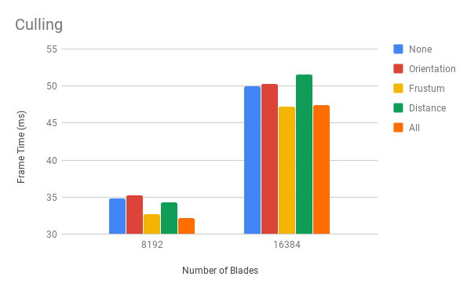

Project 6 - Vulkan Grass Rendering
========================
* Emily Vo
  * [LinkedIn](linkedin.com/in/emilyvo), [personal website](emilyhvo.com)
* Tested on: Windows 10, i7-7700HQ @ 2.8GHz 16GB, GTX 1060 6GB (Personal Computer)

### Project Overview
This project is an implementation of the paper, [Responsive Real-Time Grass Rendering for General 3D Scenes](https://www.cg.tuwien.ac.at/research/publications/2017/JAHRMANN-2017-RRTG/JAHRMANN-2017-RRTG-draft.pdf) in Vulkan. 

### Features
* Fractal Brownian Noise:
I did 3D perlin noise and sampled the noise function at different frequencies and combined those values to get a better multi octave noise value. The noise function was used as a way to generate a t-value for IQ's Cosine Color Palette. As a result, the coloring is a result of the fragment's position values.

* Twisting Wind Forces:
To implement twisting, I computed a new position using polar coordinates. I passed in time as an argument to cosine and sin functions to displace the x and z coordinates of the grade blade's v2 position by some amount along a circle. I then calculated a wind direction as the vector pointing from the current blade's v2 position to the displaced position. 

### Performance Analysis
#### Number of Grass Blades

I turned on all culling optimizations for testing this performance. As number of blades increase, the frame time increases. Unexpectedly, the frame time doesn't double, but this is likely due to the frustum culling taking effect and not rendering twice the number of blades even if the total number of blades double.

#### Culling Tests

Frustum culling is the best culling optimization. Distance had an effect at 8000 blades, but actually reduced performance in the scenario with 16000 blades. This is likely because of the camera placement which caused the distance culling to not have much of an effect, while the frustum culling had a much better effect. The orientation culling in both scenarios didn't have much impact, probably due to the camera orientation (from the top) that caused many of the blades to be fully visible.

### Resources
* [Responsive Real-Time Grass Grass Rendering for General 3D Scenes](https://www.cg.tuwien.ac.at/research/publications/2017/JAHRMANN-2017-RRTG/JAHRMANN-2017-RRTG-draft.pdf)
* [CIS565 Vulkan samples](https://github.com/CIS565-Fall-2018/Vulkan-Samples)
* [Official Vulkan documentation](https://www.khronos.org/registry/vulkan/)
* [Vulkan tutorial](https://vulkan-tutorial.com/)
* [RenderDoc blog on Vulkan](https://renderdoc.org/vulkan-in-30-minutes.html)
* [Tessellation tutorial](http://in2gpu.com/2014/07/12/tessellation-tutorial-opengl-4-3/)
* [IQ Color Palette](http://www.iquilezles.org/www/articles/palettes/palettes.htm)

