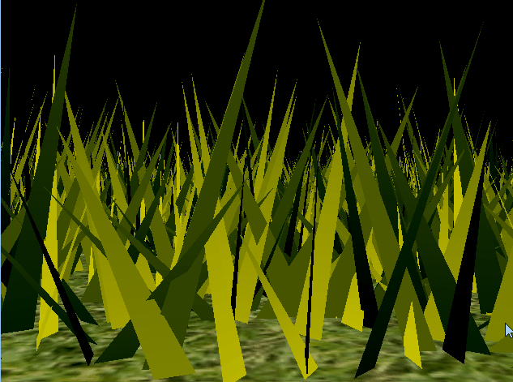

Vulkan Grass Rendering
========================
**University of Pennsylvania, CIS 565: GPU Programming and Architecture, Project 5**
* Yan Wu
	* [LinkedIn](https://www.linkedin.com/in/yan-wu-a71270159/)
* Tested on: Windows 10, i7-8750H @ 2.20GHz 16GB, GTX 1060 6GB (Personal Laptop)

**Summary:**
In this project, I use Vulkan to implement a grass simulator and renderer. I
used compute shaders to perform physics calculations on Bezier curves that represent individual
grass blades in my application. I also use compute shaders to cull grass blades that don't contribute to a given frame.

## Grass Rendering

This project is an implementation of the paper, [Responsive Real-Time Grass Rendering for General 3D Scenes](https://www.cg.tuwien.ac.at/research/publications/2017/JAHRMANN-2017-RRTG/JAHRMANN-2017-RRTG-draft.pdf).

### Representing Grass as Bezier Curves

In this project, grass blades will be represented as Bezier curves while performing physics calculations and culling operations. 
Each Bezier curve has three control points.
* `v0`: the position of the grass blade on the geomtry
* `v1`: a Bezier curve guide that is always "above" `v0` with respect to the grass blade's up vector (explained soon)
* `v2`: a physical guide for which we simulate forces on

We also need to store per-blade characteristics that will help us simulate and tessellate our grass blades correctly.
* `up`: the blade's up vector, which corresponds to the normal of the geometry that the grass blade resides on at `v0`
* Orientation: the orientation of the grass blade's face
* Height: the height of the grass blade
* Width: the width of the grass blade's face
* Stiffness coefficient: the stiffness of our grass blade, which will affect the force computations on our blade

We can pack all this data into four `vec4`s, such that `v0.w` holds orientation, `v1.w` holds height, `v2.w` holds width, and 
`up.w` holds the stiffness coefficient.

### Simulating Forces

#### Gravity

Given a gravity direction and the magnitude of acceleration, we can compute the environmental gravity in
our scene. We then determine the contribution of the gravity with respect to the front facing direction of the blade, 
as a term called the "front gravity". We can then determine the total gravity on the grass blade.

#### Recovery

Recovery corresponds to the counter-force that brings our grass blade back into equilibrium. This is derived in the paper using Hooke's law.

#### Wind
The stimulated wind is create by an arbitrary function. This function determines a wind direction that is affecting the blade.

#### Total force

Combine gracity, recovery and wind together.

### Culling tests

Although we need to simulate forces on every grass blade at every frame, there are many blades that we won't need to render
due to a variety of reasons. Here are some heuristics we can use to cull blades that won't contribute positively to a given frame.

	Orientation culling
	View-frustum culling
	Distance culling

### Tessellating Bezier curves into grass blades

In this project, I passed in each Bezier curve as a single patch to be processed by my grass graphics pipeline. I tessellated this patch into a quad with a shape of my choosing. 

## Result GIFs
* 2^11 grass with no culling  

| No force |
|---------|
|  |

Above is the grass field with no force and culling.

| Only gravity | Gravity + Recovery | All force |
|----------|----------|----------|
|  |  | |

We can see that with the adding of different forces, the grass behave differently. When we only add gravity, the grass fall onto the ground immediately. With gravity and recovery, the grass first fall a little, but then stopped at equilibrium as if they are taking a bow. And the third one is the grass perfectly blowing by the wind.

| All force + culling |
|---------|
|  |

With the culling tests, the grass which are not within range are not displayed.

### Performance Analysis

The performance analysis is where you will investigate how...
* Your renderer handles varying numbers of grass blades
* The improvement you get by culling using each of the three culling tests

