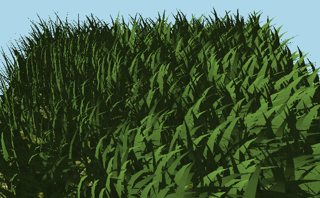
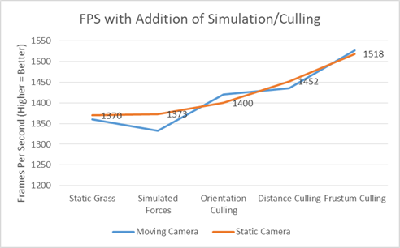
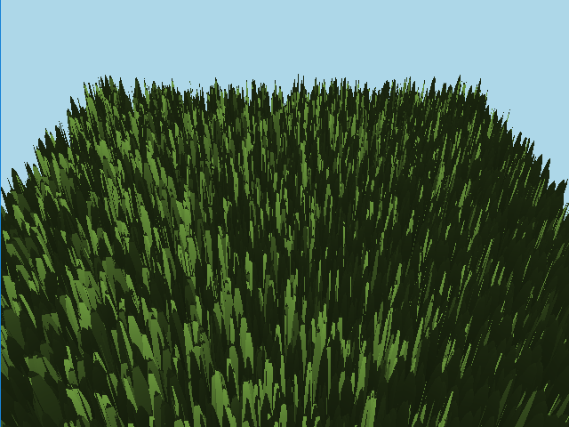

Vulkan Grass Rendering
========================

* Salaar Kohari
  * LinkedIn ([https://www.linkedin.com/in/salaarkohari](https://www.linkedin.com/in/salaarkohari))
  * Website ([http://salaar.kohari.com](http://salaar.kohari.com))
  * University of Pennsylvania, CIS 565: GPU Programming and Architecture
* Tested on: Windows 10, Intel Xeon @ 3.1GHz 32GB, GTX 980 4GB (SIG Lab)

### Introduction
My GPU path tracer produces accurate renders in real-time. The rays are scattered using visually accurate diffuse, reflection, and refraction lighting properties. Techniques such as stream compaction and particular memory allocation help speed up the iteration time. Other features of the path tracer include arbitrary mesh loading and anti-aliasing.

Some terms will be important for understanding the analysis. Each ray cast from the camera has a maximum number of **bounces** carrying the light before it terminates. When every pixel's non-deterministic path reaches the maximum bounces or does not collide with anything in the scene, one **iteration** is completed. Performance analysis will focus on number of bounces and average iteration time for various features.

### Algorithm
1. Initialize array of paths (project a ray from camera through each pixel)
2. Compute intersection with ray along its path
3. Stream compaction to remove terminated paths (optional)
4. Shade rays that intersected something using reflect, refract, or diffuse lighting to multiply with the current color of the ray
5. Repeat steps 2-4 until max bounces reached or all paths terminated
6. Add iteration results to the image, repeating steps 1-5 until max iterations reached

### Culling

Distance Culling - Render less grass the further the camera is away from the blades. Has parameters for number of buckets that grass is grouped in for distance culling as well as the interval between these buckets.

Frustum Culling - Do not render grass that is outside the viewport. Has tunable parameter for how far the grass must be outside of the viewport to not be rendered.

Orientation Culling - Do not render grass that is facing perpendicular to the camera. Has tunable parameter for what the angle between camera and grass blade must be to not be rendered.

### Analysis

Clearly, the fps increases with the addition of new culling techniques. Some of these techniques are conditional, for example, frustum culling will only hurt performance if every blade of grass is in the viewport. However, in the general case where the camera is somewhere inside the scene, all culling methods boost performance by about 50 fps or more.

Grass before any simulation forces are applied. According to the analysis, simulation forces cost very little in comparison to the fps gains by various forms of culling.