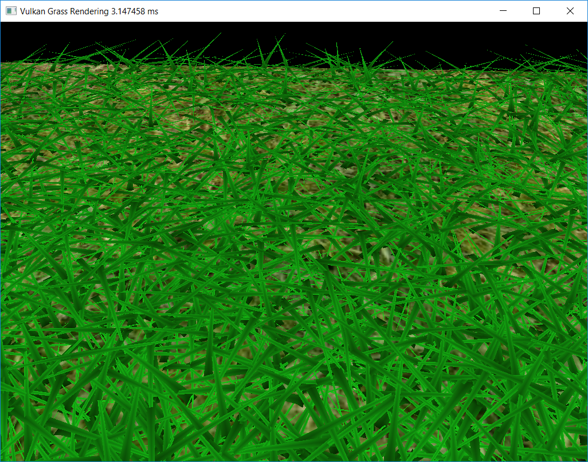
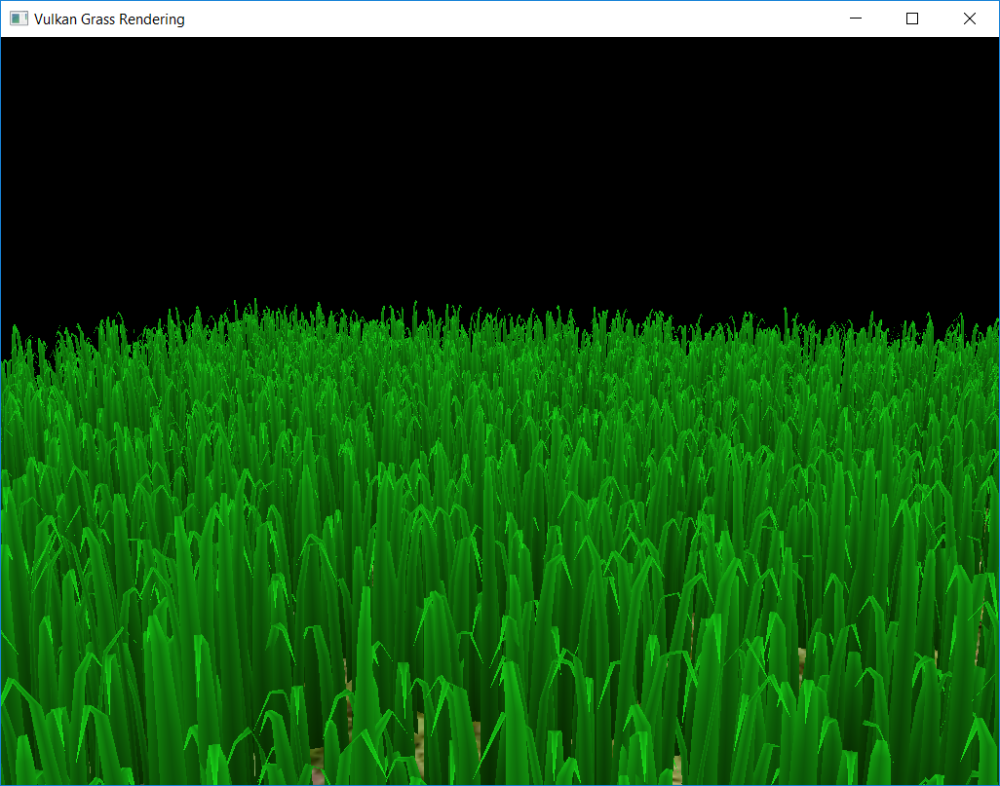

Vulkan Grass Rendering
======================

**University of Pennsylvania, CIS 565: GPU Programming and Architecture, Project 6**

* Angelina Risi
  * [LinkedIn](www.linkedin.com/in/angelina-risi)
  * [Twitter](https://twitter.com/Angelina_Risi)
* Tested on: Windows 10, i7-6700HQ @ 2.60GHz 8GB, GTX 960M 4096MB (Personal Laptop)
   
   
## Demo  
  

  
## Grass Blade Model  
  

  
### Bezier Curve & Tessellation  
  
Each grass blade is modelled with a quadratic bezier curve, with two endpoints and a control point. The compute shader uses these points to determine which blades can be seen, culling those out of view, and how natural physical forces affect the blade.  
The grass blade shape is currently a triangle. The blade is transformed from simply three points to a quad mesh using the tessellation shaders. The tessellation control shader generates uv values given inputs on how many points to split the quad into. In the evaluation shader, interpolation of the bezier curve using the v values allows us to define the  grass stalk shape. Then we need to determine the point along its width using the u value.  
```cpp
// calculate vector tangent to face to get width step vector
vec3 w = normalize(cross(normalize(t_up.xyz), t_norm.xyz)) 
        * t_v2.w / 2.0;

// recover base vertex v0
vec3 t_v0 = gl_in[0].gl_Position.xyz;

// interpolate point on Bezier Curve
vec3 p1 = ((1 - v) * t_v0) + (v * t_v1.xyz);
vec3 p2 = ((1 - v) * t_v1.xyz) + (v * t_v2.xyz);
vec3 q = ((1 - v) * p1) + (v * p2);

// get point along width
vec3 pos = (q - w*(1-v)) + 2*u*w*(1-v);

// convert to screen space and pass to fragment shader
gl_Position = camera.proj * camera.view * vec4(pos, 1.0);
```
Currently the stalk is divided vertically into 5 quads, with the width tapering to the tip. Using slightly more complicated functions one could generate more interesting grass shapes, such as folding the blade along the middle, as some grasses do.  
  
### Color  
  
The uv coordinates for each generated vertex were passed to the fragment shader to help generate the fragment colors. Four colors are defined in the shader: light green, dark green, grey, and white. First, color is interpolated vertically from the v coordinate between dark green at the base and light green at the tip. Then, a grey color is interpolated using the u coordinate between grey at the middle and white at the edges. The final output color is the multiplication of these two colors, giving a nice color gradient across the blade.  
```cpp
// Define shades of green
vec4 l_green = vec4(0.1, 0.9, 0.1, 1.0);
vec4 d_green = vec4(9.0/255.0, 51.0/255.0, 0.0, 1.0);

// grey gradient
float grey = 0.75;
float white = 1.0;

// Interpolate green shade
float v = f_uv.y;
vec4 c1 = (1-v)*d_green + v * l_green;

// Interpolate brightness
float u = 2 * abs(f_uv.x - 0.5);
float c2 = (1-u)*grey + u * white;

// Final color is multiplied
outColor = (c1 * c2);
```
  
## Grass Blade Culling  
  
For practical applications, it is important to discard redundant or unnecessary information. In this case of grass rendering, blades outside the visible area or unable to be seen clearly may be reduced in detail or discarded from the current frame. This process is achieved through multiple culling algorithms in the compute shader.  
  
### View Frustrum Culling  
  
  
  
Grass blades completely outside of the camera's view frustrum do not need to be drawn. While they will eventually be culled as they are converted to fragments out of bounds, it will potentially save GPU cycles to remove these blades beforehand.  
The base, tip and approximate midpoint coordinates are converted to screen space using the camera view and projection matrices. Then, they are compared against the screen bounds, +- 1, and the z clipping planes, z = 0 and z = 1 when converted to screen space. Additionally, a tolerance of one half-width unit is used so that partially off-screen blades may still be visible. If any of three tested points are within these bounds, the blade is considered in view and is not cullled unless it fails the culling checks.  
  
### Orientation Culling  
  
  
  
The grass blades are currently modelled without a thickness to them, as we only compute 2D tessellation of the blade plane. Thus, if the camera is looking parallel to the blade's width direction, the blade has no thickness to be seen. So that blades less than a pixel wide in screen space are culled, we compare the look vector with the blade width vector using a dot product. If the value is above a threshold, they are nearly the same direction and the blade is culled.  
  
### Distance Culling  
  
  
  
Distant blades would be less detailed and difficult to see when drawn as fragments on the screen, and may be obscured by nearer objects anyway. Since high detail is only necessary for closer blades, we can define a max view distance, beyond which blades are culled, and distance "bins". The blades are binned according to their distance from the camera. Then, the blade index modulo the bin number is used to decide whether it should be culled. This ensures fewer blades are kept if they are further away from the camera.  
For a smoother transition, more bins and smaller step sizes could be used. The max draw distance is the number of bins multiplied by the step size. Currently, it is set to ten bins with a step size of 2.0 units, giving a max draw distance of 20 units.  
  
  
## Physics Modelling
    
### Gravity  
  

  
Gravity is the natural force that attracts masses together. The gravity of the Earth is approximately 9.807 m/s<sup>2</sup>, which is used as the gravity constant in this code. The overall direction of the gravity is approximately straight down. But to be able to properly model the grass blade folding over instead of the tip moving straight down, we also define a "face" gravity component in the direction of the blade face normal at a quarter of the gravity force.  
```cpp
float g = 9.807; // 9.807 m/s^2 on Earth
// Global gravity direction should be straight down
vec3 gE = vec3(0.0, -g, 0.0);

// "Face" gravity influence, so v2 moves more 
// naturally outward instead of straight down
vec3 gF = g * norm / 4.0;
```
  
### Recovery  
  
  
  
The grass blades have an inherent "elaticity" generating a resistive force opposing changes to its natural position. This is defined by a stiffness factor multiplied by the change in the position of v2.  
  
```cpp
vec3 R = ((v0 + h * up) - v2) * stiff;
```
  
### Wind  
  
Air naturally circulates due to pressure and heat variations. This disturbance will move the light grass with some force dependent on the wind speed (it's strength) and  the direction. If the face of the grass blade is angled compared to the wind direction, the force on the blade is reduced.  
The wind generally has a prevailing direction with some fluctuation in time, and a strength also fluctuating in time. These are modelled with sinusoidal signals of different frequencies.    
```cpp
float f1 = 0.33;

// set prevailing wind direction to +x
// shift wind direction in z w/ cos in time
vec3 w_direc = normalize(vec3(1.0, 0.0, cos(f1 * totalTime + v0.z) / 4.0));

// get adjected face direction approximation
vec3 dir = normalize(vec3(x, -((v2 - v0).x * x + (v2 - v0).z * z) / (v2 - v0).y, z));

// use direction of blade to adjust wind influence
// stronger wind expected more momentum in main direction, 
// so use z direction freq^-1 to also adjust strength
float w_scale = (1.0/ f1) * abs(dot(dir, w_direc));
float f2 = 1.0;
vec3 Wind = w_scale * w_direc * (sin(f2 * totalTime + v0.x) + 2.0);
```
  
  
Once all the forces are generated, they are applied by multiplying the total force by time, and using the new vector as the shift in the position of v2.  
  
```cpp
vec3 shift = (R + gF + gE + Wind) * deltaTime;

// adjust v2 position
v2 += shift;
```
  
### Position Validation  
  
After applying the physical transformations, the grass blade may not be in an acceptable position state. It's tip, v2, may sink below ground, and without adjustment of the control point, v1, the blade will not have consistent length.  
First, the position of v2 is corrected to be at or above ground level, assuming v0 to be ground.  
```cpp
// keep v2 from going underground
float up_dot = dot(up, (v2 - v0));
v2 = v2 - up * min(up_dot, 0.0);
```  
Next, we must check the position of v1. If the position of v2 is displaced from the up vector, the position of v1 must also be displaced. Then, we must correct its position again for the correct blade length. We want the length after transformation to be approximately its original height, so we make an approximation of its current length and use the ratio with height to scale a new adjusted position of v1 and v2.  
```cpp
up_dot = dot(up, (v2 - v0));
float l_proj = length((v2 - v0) - up * up_dot);
if (l_proj != 0.0) {
	v1 = v0 + h * up * max(1.0 - l_proj / h, 
	                        0.05 * max (l_proj / h, 1.0));

	float L0 = length(v2 - v0);
	float L1 = length(v2 - v1) + length(v1 - v0);
	float n = 2.0; // degree of curve, quadratic
	float L = (2.0 * L0 + (n - 1.0)* L1) / (n + 1.0);

	float r = h / L;

	vec3 old_v1 = v1;

	v1 = v0 + r*(old_v1 - v0);
	v2 = v1 + r*(v2 - old_v1);
}
```
Under the current implementation, the blades "bounce" slightly as they are adjusted each frame, assumed due to rounding and approximations leading to oscillations around the desired settling point. Potentially, instead of using the approximation from the paper, we could determine the actual length of the blade. However, this would be more computationally expensive, as we'd have to determine the length between each point on the actual tessellated curve.
  
  
## Performance Analysis  
  
### Effects of Culling Techniques  
  
Each culling technique has some compute overhead expected per blade, but is expected to save on future computations and rasterization of unnecessary, non-visible blades.
  
  
### Number of Grass Blades  
  
The number of blades first affects the speed of the compute shader's physics and culling pass. Then, having far more blades on-screen affects the vertex and tessellation shading and rasterization steps. On the GPU, the performance effect is not expected to be drastic, such as scaling with N, due to parallelization, but the total number of blades is nonetheless expected to be be a significant contributor to performance.  
  
  
### Tessellation Level  
  
The tessellation level describes the level of detail in the rendered grass blade. For example, a 100-point curve would be far more detailed and natural looking, but assumed much more computationally expensive to define. Thus, I decided to analyze the performance for varying levels of blade tessellation.
  
  