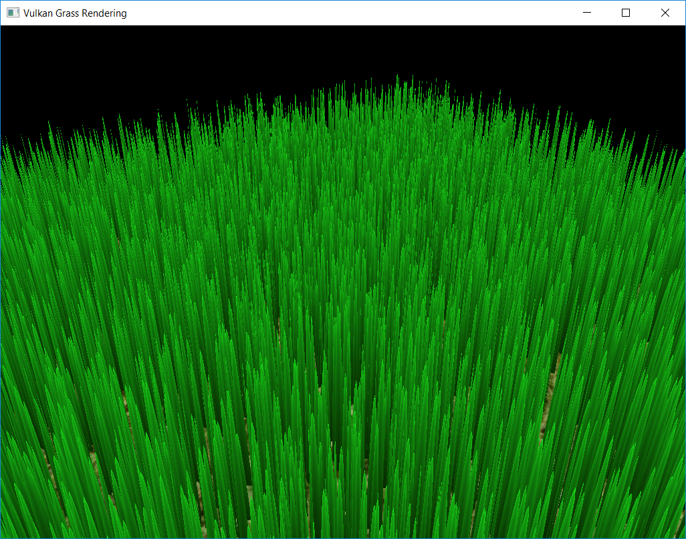

Vulkan Grass Rendering
======================

**University of Pennsylvania, CIS 565: GPU Programming and Architecture, Project 6**

* Angelina Risi
  * [LinkedIn](www.linkedin.com/in/angelina-risi)
  * [Twitter](https://twitter.com/Angelina_Risi)
* Tested on: Windows 10, i7-6700HQ @ 2.60GHz 8GB, GTX 960M 4096MB (Personal Laptop)
   
   
## Grass Blade Model  
  

  
### Bezier Curve & Tessellation  
  
Each grass blade is modelled with a quadratic bezier curve, with two endpoints and a control point. The compute shader uses these points to determine which blades can be seen, culling those out of view, and how natural physical forces affect the blade.  
The grass blade shape is currently a triangle. The blade is transformed from simply three points to a quad mesh using the tessellation shaders. The tessellation control shader generates uv values given inputs on how many points to split the quad into. In the evaluation shader, interpolation of the bezier curve using the v values allows us to define the  grass stalk shape. Then we need to determine the point along its width using the u value.  
```cpp
// calculate vector tangent to face to get width step vector
vec3 w = normalize(cross(normalize(t_up.xyz), t_norm.xyz)) 
        * t_v2.w / 2.0;

// recover base vertex v0
vec3 t_v0 = gl_in[0].gl_Position.xyz;

// interpolate point on Bezier Curve
vec3 p1 = ((1 - v) * t_v0) + (v * t_v1.xyz);
vec3 p2 = ((1 - v) * t_v1.xyz) + (v * t_v2.xyz);
vec3 q = ((1 - v) * p1) + (v * p2);

// get point along width
vec3 pos = (q - w*(1-v)) + 2*u*w*(1-v);

// convert to screen space and pass to fragment shader
gl_Position = camera.proj * camera.view * vec4(pos, 1.0);
```
Currently the stalk is divided vertically into 5 quads, with the width tapering to the tip. Using slightly more complicated functions one could generate more interesting grass shapes, such as folding the blade along the middle, as some grasses do.  
  
### Color  
  
The uv coordinates for each generated vertex were passed to the fragment shader to help generate the fragment colors. Four colors are defined in the shader: light green, dark green, grey, and white. First, color is interpolated vertically from the v coordinate between dark green at the base and light green at the tip. Then, a grey color is interpolated using the u coordinate between grey at the middle and white at the edges. The final output color is the multiplication of these two colors, giving a nice color gradient across the blade.  
```cpp
// Define shades of green
vec4 l_green = vec4(0.1, 0.9, 0.1, 1.0);
vec4 d_green = vec4(9.0/255.0, 51.0/255.0, 0.0, 1.0);

// grey gradient
float grey = 0.75;
float white = 1.0;

// Interpolate green shade
float v = f_uv.y;
vec4 c1 = (1-v)*d_green + v * l_green;

// Interpolate brightness
float u = 2 * abs(f_uv.x - 0.5);
float c2 = (1-u)*grey + u * white;

// Final color is multiplied
outColor = (c1 * c2);
```
  
    
  