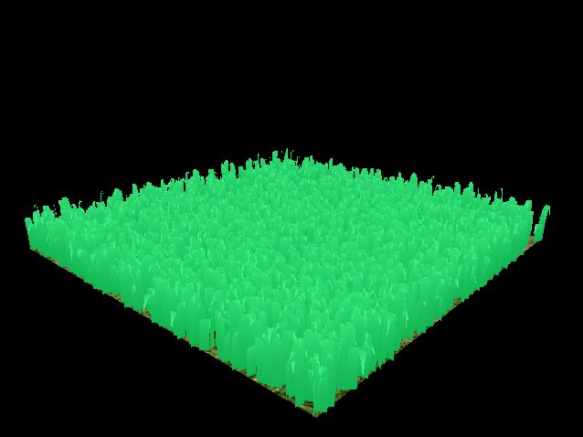
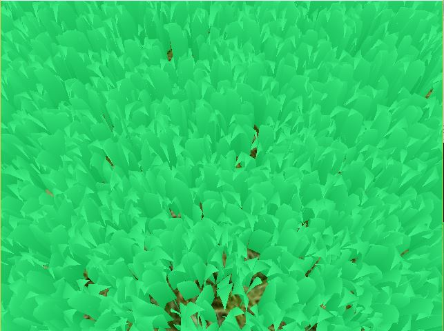
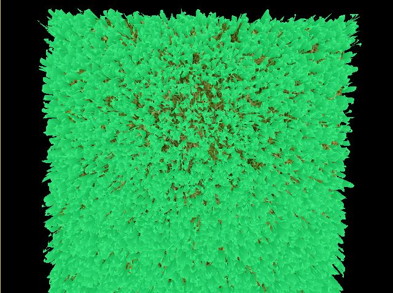

Vulkan Grass Rendering
========================
### University of Pennsylvania, CIS 565: GPU Programming and Architecture, Project 6

* Ishan Ranade
* Tested on personal computer: Gigabyte Aero 14, Windows 10, i7-7700HQ, GTX 1060

## Images

## Description

### Grass

The grass blades are be represented as Bezier curves for performing physics calculations and culling operations.
Each Bezier curve has three control points.
* `v0`: the position of the grass blade on the geomtry
* `v1`: a Bezier curve guide that is always "above" `v0` with respect to the grass blade's up vector (explained soon)
* `v2`: a physical guide for which we simulate forces on

Per-blade characteristics are also stored that will help us simulate and tessellate our grass blades correctly.
* `up`: the blade's up vector, which corresponds to the normal of the geometry that the grass blade resides on at `v0`
* Orientation: the orientation of the grass blade's face
* Height: the height of the grass blade
* Width: the width of the grass blade's face
* Stiffness coefficient: the stiffness of our grass blade, which will affect the force computations on our blade

### Forces

#### Gravity

Given a gravity direction, `D.xyz`, and the magnitude of acceleration, `D.w`, we can compute the environmental gravity in
our scene as `gE = normalize(D.xyz) * D.w`.

We then determine the contribution of the gravity with respect to the front facing direction of the blade, `f`, 
as a term called the "front gravity". Front gravity is computed as `gF = (1/4) * ||gE|| * f`.

We can then determine the total gravity on the grass blade as `g = gE + gF`.

#### Recovery

Recovery corresponds to the counter-force that brings our grass blade back into equilibrium. This is derived in the paper using Hooke's law.
In order to determine the recovery force, we need to compare the current position of `v2` to its original position before
simulation started, `iv2`. At the beginning of our simulation, `v1` and `v2` are initialized to be a distance of the blade height along the `up` vector.

Once we have `iv2`, we can compute the recovery forces as `r = (iv2 - v2) * stiffness`.

#### Wind

For wind forces, we can find the `windAlignment` as the dot product of the direction the grass blade is facing and the wind direction.  We can also create a sin wave across the entire grass patch by using sin of the x position to offset its position.  We can also create a weaker force based on how close the blade aligns with the wind direction, because if the dot product is closer to 0 the stronger the force.

#### Total force

We can then determine a translation for `v2` based on the forces as `tv2 = (gravity + recovery + wind) * deltaTime`.

### Culling

#### Orientation culling

We can cull blades where the front face direction of the grass blade is perpendicular to the view vector.  We can do a dot product test to see if the view vector and front face direction of the blade are perpendicular.

#### View-frustum culling

We also want to cull blades that are outside of the view-frustum, considering they won't show up in the frame anyway. To determine if
a grass blade is in the view-frustum, we want to compare the visibility of three points: `v0, v2, and m`, where `m = (1/4)v0 * (1/2)v1 * (1/4)v2`.
Notice that we aren't using `v1` for the visibility test. This is because the `v1` is a Bezier guide that doesn't represent a position on the grass blade.  We instead use `m` to approximate the midpoint of our Bezier curve.  If all three points are outside of the view-frustum, we will cull the grass blade.

#### Distance culling

We can also cull grass blades based on a max distance afterwhich all grass blades will be culled and a number of buckets to place grass blades between the camera and max distance into.

### Vulkan

We use a compute shader to apply the forces on the `v0`, `v1`, and `v2` points of each grass blade.  We also cull blades in the compute shader and save only the blades that we want to be visible.  We then pass to a vertex shader that just passes the data through.  Next comes a tesselation control shader which decides the tesselation inner and outer sizes and the number of extra vertices to add.  Then, we pass to a tesselation evaluation shader that positions the new vertices of the grass piece.  And finally, we send to a fragment shader that linearly interpolates between two green colors based on how far up the vertex is from the base of the grass.

## Performance

With 1048576 pieces of grass, I only experience a slightly less FPS than 60, which a dip by only 5-10 frames per second.  With 8192 pieces of grass I was getting 60 FPS which was very good performance.  With the three types of culling listed above I was not noticing any noticeable bumps in FPS, it was still hovering around 60 FPS.

## Links

The following resources may be useful for this project.

* [Responsive Real-Time Grass Grass Rendering for General 3D Scenes](https://www.cg.tuwien.ac.at/research/publications/2017/JAHRMANN-2017-RRTG/JAHRMANN-2017-RRTG-draft.pdf)
* [CIS565 Vulkan samples](https://github.com/CIS565-Fall-2018/Vulkan-Samples)
* [Official Vulkan documentation](https://www.khronos.org/registry/vulkan/)
* [Vulkan tutorial](https://vulkan-tutorial.com/)
* [RenderDoc blog on Vulkan](https://renderdoc.org/vulkan-in-30-minutes.html)
* [Tessellation tutorial](http://in2gpu.com/2014/07/12/tessellation-tutorial-opengl-4-3/)
