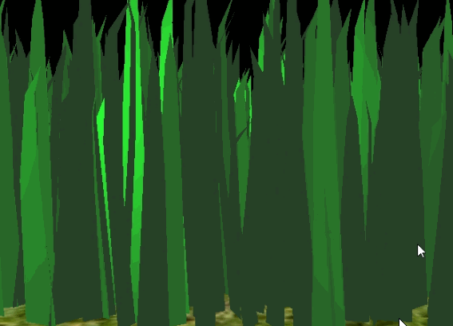
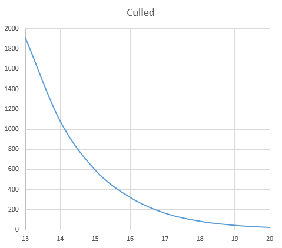
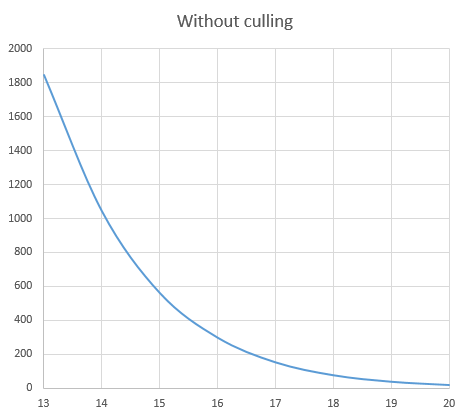
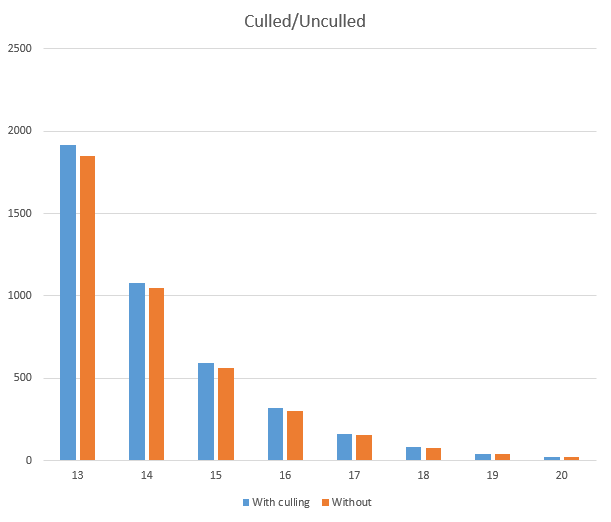

Vulkan Grass Rendering
======================

**University of Pennsylvania, CIS 565: GPU Programming and Architecture, Project 6**

* Name: Bowen Yang
  * [LinkedIn](https://www.linkedin.com/in/%E5%8D%9A%E6%96%87-%E6%9D%A8-83bba6148)
  * [GitHub](https://github.com/Grillnov)
  * [Facebook](https://www.facebook.com/yang.bowen.7399)
  * [Steam](https://steamcommunity.com/id/grillnov)
* Tested on: Windows 10 x64, i7-6800K @ 3.40GHz 32GB, GTX 1080 8GB (Personal computer at home)

### Project description

In this project, grass blades are represented as 2nd order Bezier curves, and we apply physical simulation upon it.

Simulation forces include:

# Gravity
Total gravity is determined as ```gE + gF```.
# Recovery
The force that brings the grass blades back to equilibrium. Given by ```r = (iv2 - v2) * stiffness```.
# Wind
The wind force that drives the blades around. In my implementation the wind field is given by a psuedo-random noise with respect to x and z coordinates of the blade, and the intensity is given by a function of cosine(t). 

### Demo Video/GIF
()

### Performance test

()

The performance with respect to the number of blades, when orientation culling is in effect.

()

The performance with respect to the number of blades, when orientation culling is not in effect.

(Performance comparison)

From this we can see that the performance is better with culling. Since we did a simple test to see if the orientation of the blade is facing towards us, we can cut down many unused calculations in further steps.
