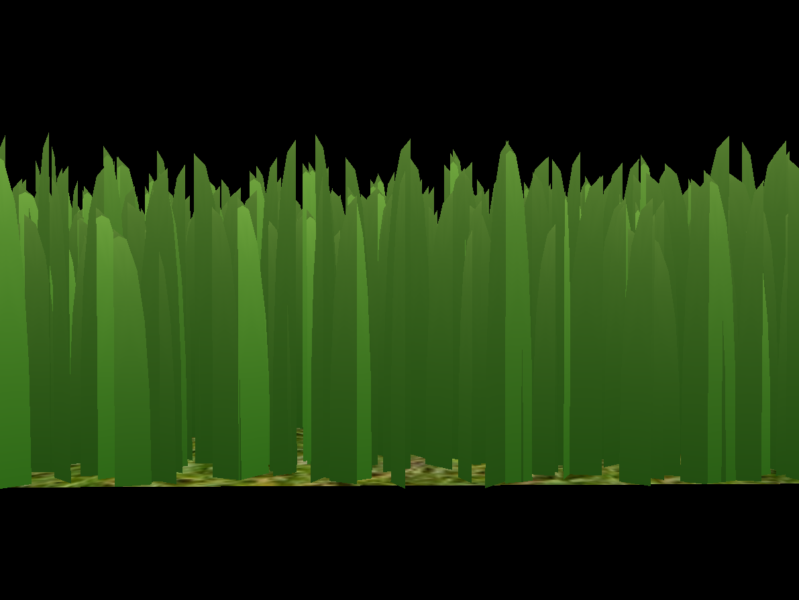
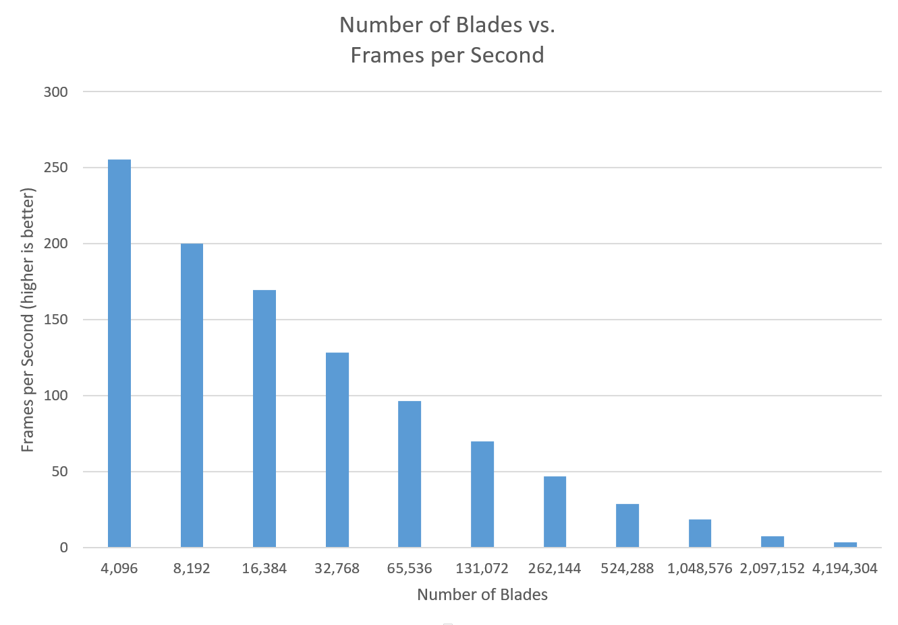
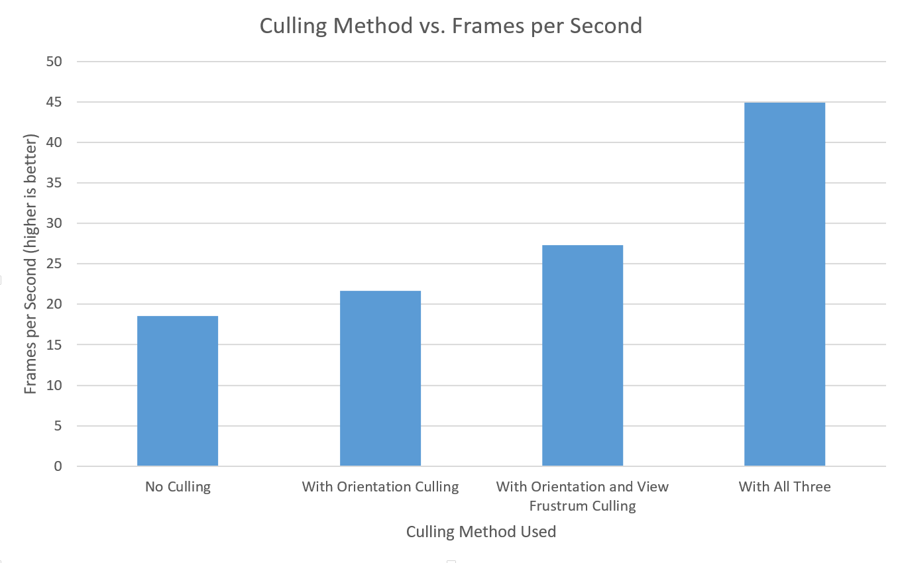
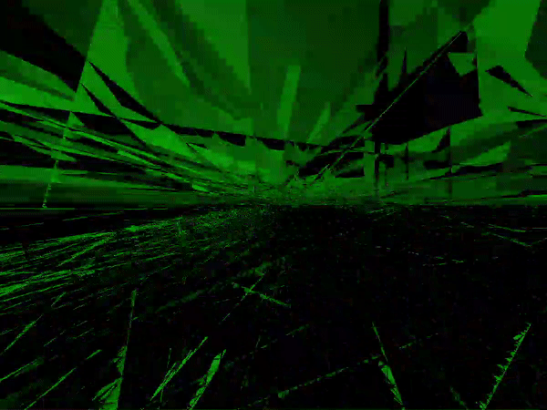

Vulkan Grass Rendering
================

**University of Pennsylvania, CIS 565: GPU Programming and Architecture, Project 6**

* Yichen Shou
  * [LinkedIn](https://www.linkedin.com/in/yichen-shou-68023455/), [personal website](http://www.yichenshou.com/)
* Tested on: Windows 10, i7-6500U @ 2.50GHz 12GB RAM, GeForce 940M 8GB (Personal Laptop)

## Project Overview

This project is a implementation of this [grass rendering paper](https://www.cg.tuwien.ac.at/research/publications/2017/JAHRMANN-2017-RRTG/JAHRMANN-2017-RRTG-draft.pdf) using Vulkan. Each grass blade is represented by a bezier curve and rendered as grass using tesselation. A compute shader is used to optimize performance by culling grass based on select criteria.

## Features 

Bezier curves with 3 control points are used to represent each blade of grass. The first control point is the actual position of the grass geometry, the second control point represents the grass's up vector, and the third control point is a physical guide for which we simualte forces on. Extra information such as stiffness, width, height, and orientation are also generated at random for each blade of grass. Various calculations are performed based on these given data to generate the final result.

### Tesselation and color interpolation

Grass is tesselated into a half-quad-half-parabolic shape. Color is interpolated from the bottom to the tip of the grass.

### Simulated Physics 

Gravity is then simulated on the three control points. Wind is added as well using a sin function offsetted with the position of the grass blade to simulate the effect of wind blowing over.

### Optimizations

3 types of culling is used in this project to optimize rendering. 

Orientation culling filters out grass blades that's not facing the camera. The gif below demonstrates the concept with exaggerated parameters. 

View-frustum culling filters out grass blades that's not completely in the frustum. The gif below demonstrates the concept with a much smaller view-frustum to demonstrate the effect.

Finally, distance culling filters out grass blades that are too far away. Grass blades are divided into sections based on distance from the camera; the farther the section, the more grass in the section is culled. The gif below shows the effect with a much shorter culling distance to demonstrate the effect

## Performance analysis

Here you can see that as the number of blades increased, the framerate steadily decreased. The program can still handle up to 2^18 blades with 30+ FPS though.

The different culling methods also add a great deal to the performance of the program, with distance culling being the most useful out of the three, followed closely by orientation culling.

## Bloopers

When you don't do the shaders right, you get a crazy green rave party.

## References
- [Responsive Real-Time Grass Grass Rendering for General 3D Scenes](https://www.cg.tuwien.ac.at/research/publications/2017/JAHRMANN-2017-RRTG/JAHRMANN-2017-RRTG-draft.pdf)
- [Vulkan tutorial](https://vulkan-tutorial.com/)
- [Tesselation tutorial](http://in2gpu.com/2014/07/12/tessellation-tutorial-opengl-4-3/)
- Class slides on [Vulkan](https://docs.google.com/presentation/d/1Z73IcuyFUBxl3uOS_dqLa4vnLsa1ftq943LegQxDal0/edit?usp=sharing) and [Grass Rendering](https://docs.google.com/presentation/d/1JtH3FP_jNtG8RoCOz1XiblEEH5AFBHKGEbz85sWjRvQ/edit?usp=sharing).