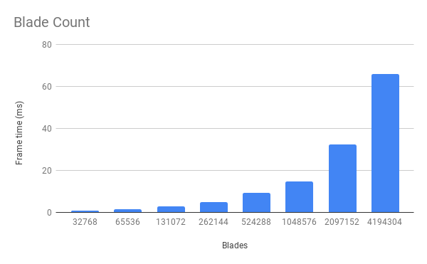
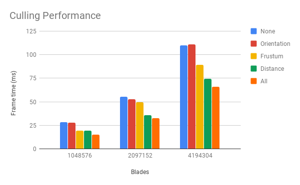

Vulkan Grass Rendering
======================

* Alexander Chan
* Tested on: Windows 10 Version 1803, i7-5820k @ 3.70 GHz 16GB, GTX 1080 @ 1620 MHz 8GB (Personal Computer)

## Summary
Real time grass simulator and renderer in Vulkan using compute and tesselation shaders. Simulates a
rolling sphere of varying radius (flattening the grass as it rolls on top). Optimizations include
orientation culling, frustum culling, and distance culling.

## Performance

As the number of blades doubles, the frame time roughly doubles as well. There is a linear relationship
between the frame time and number of blades of grass.

The orientation culling provides little to no benefit, but this could likely be due to the way the camera
is positioned. The frustum culling provides a much more noticeable benefit, which is also camera dependent (
moving the camera so that all blades of grass are visible doesn't provide much benefit, as no blades are culled).
The distance culling also provides a substantial benefit. Combined, the two cover scenarios the other would not,
such as being very close to the grass (so distance culling is not in play, but frustum culling is), and being far enough
to see all the blades of grass (so distance culling helps).

With a million blades, all optimizations are necessary to achieve 60fps.

## Resources
* [Responsive Real-Time Grass Grass Rendering for General 3D Scenes](https://www.cg.tuwien.ac.at/research/publications/2017/JAHRMANN-2017-RRTG/JAHRMANN-2017-RRTG-draft.pdf)
* [CIS565 Vulkan samples](https://github.com/CIS565-Fall-2018/Vulkan-Samples)
* [Official Vulkan documentation](https://www.khronos.org/registry/vulkan/)
* [Vulkan tutorial](https://vulkan-tutorial.com/)
* [RenderDoc blog on Vulkan](https://renderdoc.org/vulkan-in-30-minutes.html)
* [Tessellation tutorial](http://in2gpu.com/2014/07/12/tessellation-tutorial-opengl-4-3/)