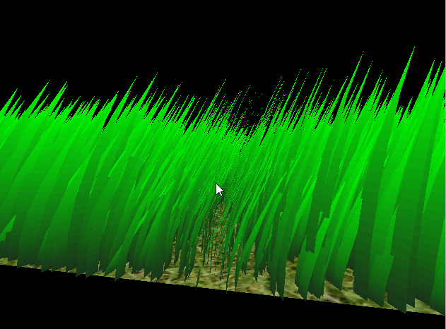

Vulkan-Grass-Rendering
===============

[CLICK ME FOR INSTRUCTION OF THIS PROJECT](./INSTRUCTION.md)

**University of Pennsylvania, CIS 565: GPU Programming and Architecture, Project 6**

* Xinyu Lin
[Linkedin](https://www.linkedin.com/in/xinyu-lin-138352125/)
* Tested on: Windows 10, Intel(R) Core(TM) i7-6700HQ CPU@2.60GHz, 16GB, GTX960M(Private Computer)

### Final Render

### Introduction

This project is an implementation of [Responsive Real-Time Grass Rendering for General 3D Scenes](https://www.cg.tuwien.ac.at/research/publications/2017/JAHRMANN-2017-RRTG/JAHRMANN-2017-RRTG-draft.pdf). Grass blades are efficiently generated and rendered by modeling them as quadratic bezier curves. The twist: utilizing the GPU with Vulkan. Using Vulkan to parallelize rendering and force computations allows for up to 2^20 individual grass blades to be displayed with a decent framerate. A more in depth performance analysis is at the bottom of the page.  

Here is an overview of the graphics pipeline:  
  * Compute shader - Calculates gravity, recovery, and wind forces. Performs orientation, frustum, and distance culling.  
  * Vertex shader - Simplay passes data along as is.  
  * Tessellation Control shader - Provides subdivision parameters  
  * Tessellation Evaluation shader - Adds new vertices by subdiving, turning a bezier curve into a 2D surface. Moves the vertices so they follow the bezier curve.  
  * Fragment shader - Colors the fragments. 
  
#### Grass Geometry

Each blade of grass is represented as a quadratic bezier curve. It has three control points: v0, v1, and v2. v0 is the base of the grass on the ground. v1 is a control point that determines the curve, but is not used for rendering. v2 is the tip of the grass.  
  
An image from the paper showing the bezier curve control points of a blade of grass.  

#### Features

* Compute shader
  * Add forces: gravity, recovery and wind
  * Perform culling: orientation, view-frustum and distance
* Grass pipeline stages
  * Vertex shader: transform vertices
  * Tessellation control shader: passing needed info and tessellation level
  * Tessellation evaluation shader: performing interpolation along Bezier Curves
  * Fragment shader: final shading
  
#### Culling

Orientation Culling | View-frustum Culling | Distance Culling
:--:|:--:|:--:
||

### Performance Analysis
#### Performance of different blade numbers (all culling)

  

* The above chart shows how the average Fps changes with increasing grass blades. When the number of grass blades reaches 2^25, the computer crashes. And the Fps decreaes when the number of grass blades increases.

## Resources

### Links

The following resources may be useful for this project.

* [Responsive Real-Time Grass Grass Rendering for General 3D Scenes](https://www.cg.tuwien.ac.at/research/publications/2017/JAHRMANN-2017-RRTG/JAHRMANN-2017-RRTG-draft.pdf)
* [CIS565 Vulkan samples](https://github.com/CIS565-Fall-2018/Vulkan-Samples)
* [Official Vulkan documentation](https://www.khronos.org/registry/vulkan/)
* [Vulkan tutorial](https://vulkan-tutorial.com/)
* [RenderDoc blog on Vulkan](https://renderdoc.org/vulkan-in-30-minutes.html)
* [Tessellation tutorial](http://in2gpu.com/2014/07/12/tessellation-tutorial-opengl-4-3/)
