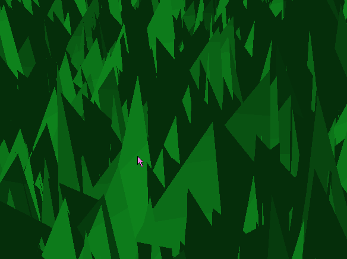

Vulkan Grass Rendering
===============

**University of Pennsylvania, CIS 565: GPU Programming and Architecture, Project 6**

Hannah Bollar: [LinkedIn](https://www.linkedin.com/in/hannah-bollar/), [Website](http://hannahbollar.com/)

Tested on: Windows 10 Pro, i7-6700HQ @ 2.60GHz 15.9GB, GTX 980M (Personal)

____________________________________________________________________________________

   

[//]: # ( 

[Overview](#Overview) - [Features](#features) - [Forces](#forces) - [Culling](#culling) - [Runtime Comparisons](#runtime-comparisons) - [Shading](#shading) - [Bloopers](#bloopers) - [References](#references) 

## Overview

The focus of this project was as an introduction to the Vulkan graphics pipelines while implementing [this](https://www.cg.tuwien.ac.at/research/publications/2017/JAHRMANN-2017-RRTG/JAHRMANN-2017-RRTG-draft.pdf) grass rendering paper.

## Features

- [x] Forces
  - [x] gravity
  - [x] recovery
  - [x] wind
    - [x] base wind from paper
    - [x] wind type 2
- [x] Culling
  - [x] orientation
  - [x] frustum
  - [x] distance
- [x] shading
  - [x] tesselation shader
  - [x] color
    - [x] by uvs for debugging
    - [x] lambert

### Forces

`Gravity` - The downward pull on the grass to make it fall.

`Recovery` - The upward pull on the grass to prevent all of them from being flat on the ground.

`Wind` - a wind effect is added to the grass based on time to make it look like wind is blowing through the grass. I implemented the basic wind effect from the paper and additional one as well.

Though there are those forces applied to the grass, I've also implemented clamping to make sure the blade never falls below the surface of the ground and that the ordering of the points on the bezier curve remain in order on the line as they're supposed to be (ie the blade never folds into itself). This maintains an overall properly bent shape without it being flimpsy or bent perfectly like folded paper.

- Wind 0 is a large wind affecting the whole group.
- Wind 1 is a small wavelike undulation across the grass.

`*`Gravity and Recovery with the following two wind implementations:

Wind 0 | Wind 1
:-------------------------:|:-------------------------:
| 

### Culling

Culling is a way to reduce the number of total blades neeing to be passed through the scene and thus reduces overall render time based on the following implemented features: orientation, frustum, distance.

`All gifs below for culling are exaggerated to better show the effects.`

Orientation Culling Top View | Orientation Culling Side View
:-------------------------:|:-------------------------:
| 

`Orientation` - Orientation culling follows the idea that if a blade of grass is pointed to not be facing us within a margin of error, just dont include it in that render pass since we can barely see it. I added in the comparison of top versus side view, because I'm currently culling s.t. in the top down view of the blades of grass, if the camera is looking directly at the blade, it is still visible, yet if it's between the threshold to being directly at the blade, cull it. Thus we can see blades that we're directly looking down on just so we have a better view of the propagating wind. This leads to movement of the "circle of blades" as can be seen in the `Top View` gif, which describes the section of thicker blades moving through the blades of grass with the wind because of the culling. The side view just demonstrates what happens with an exaggerated culling threshold for the blades based on their orientation.

No Culling | Frustum and Distance Culling
:-------------------------:|:-------------------------:
| 

`Frustum` - For frustum culling, the idea is that if a blade isnt in the viewing frustum of the camera, then it can be ignored for rendering in the scene.

`Distance` - For distance culling, the first step is to cull all blades after a distance (commonly referred to as render distance in games). Then for all blades closer to us, we start culling by their "buckets." That is, for blades within a specific distance from the camera, we cull a specific percentage, with the percentage being smaller the closer to the camera and larger the farther away the bucket is from the camera.

#### Runtime Comparisons

Culling is done to optimize different scene's runtime by removing unnecessary elements from the visual without affecting the quality of the scene.

### Shading

#### Tesselation Shader

Before actually using the information for color shading and/or movement manipulation, the blade's mesh of vertices is converted int a quad in the tesselation shader which are reshaped with a bezier curve and additional manipulations s.t. future calculations are done on blades that each exist as a single vertex with two or more points to create a full bezier curve of the grass.

#### Color

Lambert | UVs
:-------------------------:|:-------------------------:
| 

I clamped the lambert coloring so that it was always above a certain threshold so the blades didnt blend in with the black background. The uv texturing was used at the beginning to better visualize how the blades were moving in space and how they were set up while I was implementing additional features.

## Bloopers

Static Image | Gif of flickering
:-------------------------:|:-------------------------:
| 

Right after I first implemented wind and the render pipeline but before any culling, I started getting an error I was missing a flag even while my rendering visualized the blades properly. There was some (barely) noticeable flickering when the camera wasnt moving because of this (I knew it wasn't an atomic issue, because I had already used that for indexing appropriately). Once I re-added in that flag as required the flickering went away along with Vulkan's error message.

## References

* [Responsive Real-Time Grass Grass Rendering for General 3D Scenes](https://www.cg.tuwien.ac.at/research/publications/2017/JAHRMANN-2017-RRTG/JAHRMANN-2017-RRTG-draft.pdf)
* [CIS565 Vulkan samples](https://github.com/CIS565-Fall-2018/Vulkan-Samples)
* [Official Vulkan documentation](https://www.khronos.org/registry/vulkan/)
* [Vulkan tutorial](https://vulkan-tutorial.com/)
* [RenderDoc blog on Vulkan](https://renderdoc.org/vulkan-in-30-minutes.html)
* [Tessellation tutorial](http://in2gpu.com/2014/07/12/tessellation-tutorial-opengl-4-3/)