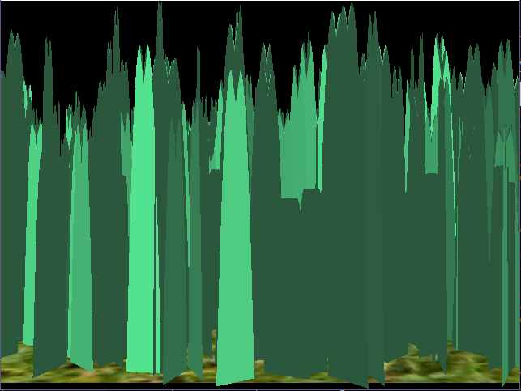
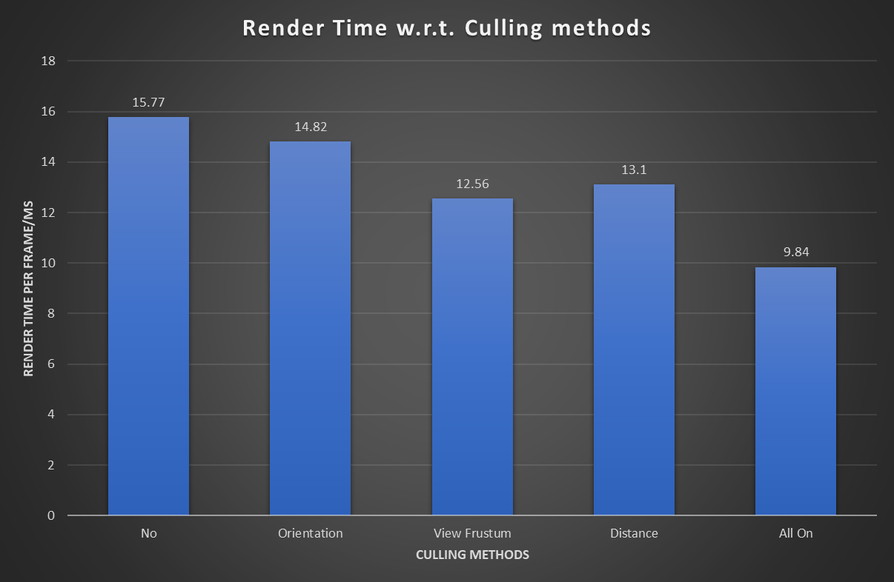

Grass Tessellation on Vulkan
======================

**University of Pennsylvania, CIS 565: GPU Programming and Architecture, Project 5**

**Anantha Srinivas**
[LinkedIn](https://www.linkedin.com/in/anantha-srinivas-00198958/), [Twitter](https://twitter.com/an2tha)

**Tested on:**
* Windows 10, i7-8700 @ 3.20GHz 16GB, GTX 1080 8097MB (PC)

# Introduction

This implementation of grass rendering is based on the paper [Responsive Real-Time Grass Grass Rendering for General 3D Scenes](https://www.cg.tuwien.ac.at/research/publications/2017/JAHRMANN-2017-RRTG/JAHRMANN-2017-RRTG-draft.pdf)

In its most basic form, each blade of grass can be thought of as a Bezier curve, with three control points v0, v1 and v2 as shown in the figure. Using tessellation shader we either add more points or reduce them based on factors such as distance from camera. 

# Implementation Details

## Simulating forces
1) Gravity:

|No gravity| Gravity|
|----| ----|
|||

2) Recovery:
This is the force that brings back the grass to its initial rest position. Seen in Figure 1.

3) Wind Force:
An external force that changes the orienation of the grass blade. Seen in Figure 1.

## Culling tests

1) Orientation Culling

|No Culling| With Culling|
|----| ----|
|||

2) View-frustrum culling

Here we cull the grass blades that do not lie in the view frustrum. Unfortunalty we wont be able to see its effect, since it will be offscreen. However, we can always refer to the performance improvements.

3) Distance Culling

|No Culling| With Culling|
|----| ----|
|||

# Performance Analysis

## Testing Conditions
1) V-Sync turned off
2) Run in Debug mdoe
3) Performance read using VK_LAYER_LUNARG_monitor extension
4) Number of grass blades = 2 ^ 20. Dimensions of quad is 150 x 150

## Performance of different types of culling

From the above graph we can clearly see that culling of unnecessary geometry has a great performance impact. We can conclude:

1) Frustum culling has the best performance improvements.
2) Distance culling also has levels of improvements, however with this testing scenario, the max distance was close to full size to simulate game like situation.
3) Orientation culling can only slightly depending upon the threshold chosen for angle cutoff.

## Performance of different levels of tessellations

* In case of constant tessellations, the outer edges were subdivided into 15 regions.
* In case of distance based tessellation, the outer edges were subdivided betwwen 1 and 15 subedges, depending upon the distance of the grass blade from camera.

# Credits

The following resources were used in the implementation of this project.

* [Responsive Real-Time Grass Grass Rendering for General 3D Scenes](https://www.cg.tuwien.ac.at/research/publications/2017/JAHRMANN-2017-RRTG/JAHRMANN-2017-RRTG-draft.pdf)
* [CIS565 Vulkan samples](https://github.com/CIS565-Fall-2018/Vulkan-Samples)
* [Official Vulkan documentation](https://www.khronos.org/registry/vulkan/)
* [Vulkan tutorial](https://vulkan-tutorial.com/)
* [RenderDoc blog on Vulkan](https://renderdoc.org/vulkan-in-30-minutes.html)
* [Tessellation tutorial](http://in2gpu.com/2014/07/12/tessellation-tutorial-opengl-4-3/)
