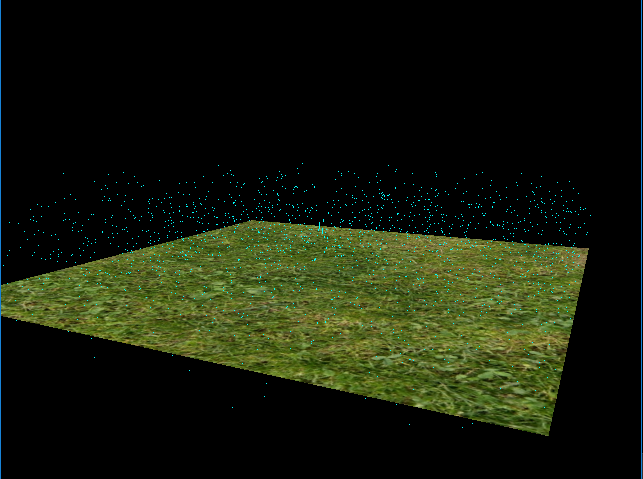

Vulkan Grass Rendering
======================

**University of Pennsylvania, CIS 565: GPU Programming and Architecture, Project 6**

* Liam Dugan -- Fall 2018
  * [LinkedIn](https://www.linkedin.com/in/liam-dugan-95a961135/), [personal website](http://liamdugan.com/)
* Tested on: Windows 10, Intel(R) Xeon(R) CPU E5-2687W v3 @ 3.10GHz 32GB, TITAN V 28.4GB (Lab Computer)

What is Grass Rendering?
=============
This project is an implementation of the paper, [Responsive Real-Time Grass Rendering for General 3D Scenes](https://www.cg.tuwien.ac.at/research/publications/2017/JAHRMANN-2017-RRTG/JAHRMANN-2017-RRTG-draft.pdf). 

It involves two different rendering passes. First there's a compute pass which calculates the forces exerted on the blades and decides whether or not the given blade should be culled, then the second render pass tessellates the culled grass blades to different levels of detail based on the bezier curve points' distance from the camera and renders them with simple Lambertian shading to get the final blade output.

## Representing Grass as Bezier Curves

Grass blades are represented as Bezier curves while performing physics calculations and culling operations. 
Each Bezier curve has three control points.
* `v0`: the position of the grass blade on the geomtry
* `v1`: a Bezier curve guide that is always "above" `v0` with respect to the grass blade's up vector (explained soon)
* `v2`: a physical guide for which we simulate forces on

We also store per-blade characteristics that will help us simulate and tessellate our grass blades correctly.
* `up`: the blade's up vector, which corresponds to the normal of the geometry that the grass blade resides on at `v0`
* Orientation: the orientation of the grass blade's face
* Height: the height of the grass blade
* Width: the width of the grass blade's face
* Stiffness coefficient: the stiffness of our grass blade, which will affect the force computations on our blade

We can pack all this data into four `vec4`s, such that `v0.w` holds orientation, `v1.w` holds height, `v2.w` holds width, and 
`up.w` holds the stiffness coefficient.

## Simulating Forces
In this project, the forces on grass blades are simulated in a compute shader while they are still Bezier curves. The simulated forces are:

#### Gravity

Given a gravity direction, `D.xyz`, and the magnitude of acceleration, `D.w`, we can compute the environmental gravity in
our scene as `gE = normalize(D.xyz) * D.w`.

We then determine the contribution of the gravity with respect to the front facing direction of the blade, `f`, 
as a term called the "front gravity". Front gravity is computed as `gF = (1/4) * ||gE|| * f`.

We can then determine the total gravity on the grass blade as `g = gE + gF`.

#### Recovery

Recovery corresponds to the counter-force that brings our grass blade back into equilibrium. This is derived in the paper using Hooke's law.
In order to determine the recovery force, we need to compare the current position of `v2` to its original position before
simulation started, `iv2`. At the beginning of our simulation, `v1` and `v2` are initialized to be a distance of the blade height along the `up` vector.

Once we have `iv2`, we can compute the recovery forces as `r = (iv2 - v2) * stiffness`.

#### Wind

In order to simulate wind, a sine function based on the x and y position of `v0` along with the `totalTime` passed is used to calculate the magnitude of the wind vector. This wind direction has a larger impact on
grass blades whose forward directions are parallel to the wind direction. The paper describes this as a "wind alignment" term. 

Once we have a wind direction and a wind alignment term, the total wind force (`w`) is calculated by doing `windDirection * windAlignment`.

#### Total force

We then determine a translation for `v2` based on the forces as `tv2 = (gravity + recovery + wind) * deltaTime`. However, we can't simply
apply this translation and expect the simulation to be robust. Our forces might push `v2` under the ground! Similarly, moving `v2` but leaving
`v1` in the same position will cause our grass blade to change length, which doesn't make sense.

We use section 5.2 of the paper in order to learn how to determine the corrected final positions for `v1` and `v2`. 

## Culling tests
Although forces are simulated on every grass blade at every frame, there are many blades that do not need to be rendered
due to a variety of reasons. Here are some heuristics we can use to cull blades that won't contribute positively to a given frame.

#### Orientation culling
 Consider the scenario in which the front face direction of the grass blade is perpendicular to the view vector. Since our grass blades
won't have width, we will end up trying to render parts of the grass that are actually smaller than the size of a pixel. This could
lead to aliasing artifacts.

In order to remedy this, we can cull these blades! Simply do a dot product test to see if the view vector and front face direction of
the blade are perpendicular. For this we use a threshold value of `0.8` to cull.

#### View-frustum culling
 We also want to cull blades that are outside of the view-frustum, considering they won't show up in the frame anyway. To determine if
a grass blade is in the view-frustum, we want to compare the visibility of three points: `v0, v2, and m`, where `m = (1/4)v0 * (1/2)v1 * (1/4)v2`.
Notice that we aren't using `v1` for the visibility test. This is because the `v1` is a Bezier guide that doesn't represent a position on the grass blade.
We instead use `m` to approximate the midpoint of our Bezier curve.

If all three points are outside of the view-frustum, we will cull the grass blade. The paper uses a tolerance value for this test so that we are culling
blades a little more conservatively. This can help with cases in which the Bezier curve is technically not visible, but we might be able to see the blade
if we consider its width.

#### Distance culling
 Similarly to orientation culling, we can end up with grass blades that at large distances are smaller than the size of a pixel. This could lead to additional
artifacts in our renders. In this case, we can cull grass blades as a function of their distance from the camera.

We define two parameters here.
* A max distance afterwhich all grass blades will be culled.
* A number of buckets to place grass blades between the camera and max distance into.

The grass blades in the bucket closest to the camera are kept while an increasing number of grass blades
are culled with each farther bucket.

## Tessellating Bezier curves with varying levels of detail
In this project, we pass in each Bezier curve as a single patch to be processed by your grass graphics pipeline. We tessellate this patch into a quad with a quadratic shape 

In the tessellation control shader, we set the base level of inner and outer tessellation for when the blades are at `MAX_DISTANCE` to be 2.0 and we set the highest level of tessellation to be `6.0` when the blades are at distance 0 and interpolate between them.

Performance Analysis
=============

The performance analysis is where you will investigate how...
* Your renderer handles varying numbers of grass blades
* The improvement you get by culling using each of the three culling tests

Bloopers
=============

Credits
=============

The following resources were very useful in the creation of this project

* [Responsive Real-Time Grass Grass Rendering for General 3D Scenes](https://www.cg.tuwien.ac.at/research/publications/2017/JAHRMANN-2017-RRTG/JAHRMANN-2017-RRTG-draft.pdf)
* [CIS565 Vulkan samples](https://github.com/CIS565-Fall-2018/Vulkan-Samples)
* [Official Vulkan documentation](https://www.khronos.org/registry/vulkan/)
* [Vulkan tutorial](https://vulkan-tutorial.com/)
* [RenderDoc blog on Vulkan](https://renderdoc.org/vulkan-in-30-minutes.html)
* [Tessellation tutorial](http://in2gpu.com/2014/07/12/tessellation-tutorial-opengl-4-3/)
